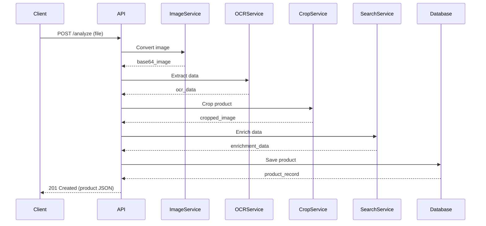

## Endpoint

<ParamField body="POST /api/v1/pipeline/analyze" type="endpoint">
  Full product analysis pipeline endpoint
</ParamField>

```http
POST /api/v1/pipeline/analyze
```

## Overview

This is the main endpoint of Entropi API. It orchestrates the complete pipeline:

1. Image Conversion - Converts HEIC/JPEG/PNG to optimized format
2. OCR Extraction - Extracts product information using Groq Vision
3. Smart Cropping - Detects and crops the main product
4. Search Enrichment - Finds merchant URL and scrapes additional data
5. Database Storage - Saves product to PostgreSQL

## Request

<ParamField body="file" type="file" required>
  Product screenshot (HEIC/JPEG/PNG/WebP)
</ParamField>

### Headers

```http
Content-Type: multipart/form-data
```

### cURL Example

<CodeGroup>
```bash cURL
curl -X POST "http://localhost:8000/api/v1/pipeline/analyze" \
  -H "Content-Type: multipart/form-data" \
  -F "file=@screenshot.jpg"
```

```python Python
import requests

url = "http://localhost:8000/api/v1/pipeline/analyze"
files = {"file": open("screenshot.jpg", "rb")}

response = requests.post(url, files=files)
product = response.json()
```

```javascript JavaScript
const formData = new FormData();
formData.append('file', fileInput.files[0]);

const response = await fetch('http://localhost:8000/api/v1/pipeline/analyze', {
  method: 'POST',
  body: formData
});

const product = await response.json();
```
</CodeGroup>

## Response

### Success Response (201 Created)

```json title="success_response.json"
{
  "id": 1,
  "name": "UBURN - LA BOISSON VIOLETTE ANTI-FRINGALES",
  "price": 34.5,
  "description": "A purple drink product set for weight loss...",
  "image_url": "data:image/jpeg;base64,/9j/4AAQ...",
  "currency": "EUR",
  "merchant": "Not specified",
  "product_url": "https://example.com/product/123",
  "category": "Dietary Supplements",
  "tags": "weight-loss, supplements, search_confidence:95",
  "object_type": "Dietary Supplement Kit",
  "created_at": "2026-02-05T11:51:04.809415-08:00"
}
```

<ParamField body="id" type="integer">
  Product ID (auto-generated)
</ParamField>
<ParamField body="name" type="string">
  Product name (from OCR)
</ParamField>
<ParamField body="price" type="float">
  Product price (numeric)
</ParamField>
<ParamField body="description" type="string">
  Product description
</ParamField>
<ParamField body="image_url" type="string">
  Base64-encoded cropped product image (data URI format)
</ParamField>
<ParamField body="currency" type="string">
  Currency code (EUR, USD, etc.)
</ParamField>
<ParamField body="merchant" type="string">
  Brand or merchant name
</ParamField>
<ParamField body="product_url" type="string">
  Merchant product URL (from enrichment, if found)
</ParamField>
<ParamField body="category" type="string">
  Product category
</ParamField>
<ParamField body="tags" type="string">
  Comma-separated tags (may include search_confidence)
</ParamField>
<ParamField body="object_type" type="string">
  Type of object (e.g., "leather jacket")
</ParamField>
<ParamField body="created_at" type="timestamp">
  Product creation timestamp
</ParamField>

## Error Responses

### 400 Bad Request

Invalid file or file read error.

```json title="error_400.json"
{
  "detail": "Could not read file: ..."
}
```

### 422 Unprocessable Entity

Image conversion or OCR extraction failed.

```json title="error_422.json"
{
  "detail": "Image conversion failed: ..."
}
```

```json title="error_422_ocr.json"
{
  "detail": "OCR analysis failed: ..."
}
```

### 500 Internal Server Error

Database save failed.

```json title="error_500.json"
{
  "detail": "Failed to save product: ..."
}
```

## Pipeline Flow



## Processing Time

The endpoint is synchronous and may take 10-18 seconds to complete:

- Image conversion: ~200ms
- OCR extraction: ~3-5s
- Smart cropping: ~2-3s
- Search enrichment: ~5-10s
- Database save: ~100ms

<Note>
  For production, consider implementing async task queues (Celery, RQ) to process requests in the background.
</Note>

## Supported Image Formats

| Format | Description |
|--------|-------------|
| HEIC | iOS screenshots (primary use case) |
| JPEG | Standard JPEG images |
| PNG | PNG images |
| WebP | WebP format |

## Graceful Degradation

The pipeline implements graceful degradation:

| Service Failure | Behavior |
|----------------|----------|
| Crop Service Failure | If cropping fails, the original image is used. Pipeline continues |
| Search Enrichment Failure | If enrichment fails or confidence is low, only OCR data is saved. Pipeline continues |

## Example Use Cases

| Use Case | Description |
|----------|-------------|
| Instagram Product | Upload screenshot of Instagram product post |
| E-commerce Page | Upload screenshot of product page |
| TikTok Product | Upload screenshot of TikTok product video |
| Web Product | Upload screenshot of any product webpage |

## Testing

Test the endpoint with a sample screenshot:

```bash title="test_curl.sh"
# Using cURL
curl -X POST "http://localhost:8000/api/v1/pipeline/analyze" \
  -F "file=@test-screenshot.jpg"
```

```python title="test_python.py"
# Using Python
import requests
response = requests.post(
    'http://localhost:8000/api/v1/pipeline/analyze',
    files={'file': open('test-screenshot.jpg', 'rb')}
)
print(response.json())
```

## Related Resources

- [Authentication](/api-reference/authentication) - Learn about authentication
- [Architecture](/architecture) - Understand the pipeline
- [Services](/services/overview) - Explore service details
