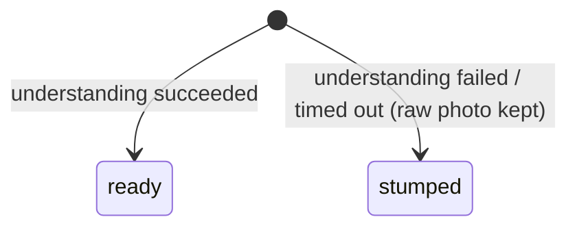

## Endpoint

```http
POST /pipeline/analyze
```

## Overview

`POST /pipeline/analyze` is the main capture endpoint. It runs the whole
pipeline **in the request** — image prep &rarr; visual understanding
(single Gemini 2.5 Flash call) &rarr; local crop &rarr; embedding &rarr;
persist — and returns the finished `Product` in a `201 Created`. There is
no background task and no polling.

The row is created directly in its terminal state: `ready` on success, or
`stumped` (best-effort, keeping the raw photo) when understanding fails or
times out.

<Note>
  Concurrent captures run in real parallel: the route is async, every
  external call is awaited, and the CPU-bound Pillow work is offloaded via
  `asyncio.to_thread`. A per-request timeout (45&nbsp;s) caps the
  understanding step. There are **zero web calls** in the capture path.
</Note>

## Request

### Authentication

```http
Authorization: Bearer <access_token>
```

Obtain a token via [`POST /auth/login`](/api-reference/authentication).

### Headers

```http
Content-Type: multipart/form-data
```

### Body (multipart/form-data)

<ParamField body="list_id" type="integer" required>
  ID of the list/board the resulting product should be attached to. Must be
  owned by the authenticated user.
</ParamField>

<ParamField body="file" type="file" required>
  A screenshot or camera photo. Accepted formats: HEIC, JPEG, PNG, WebP.
  Maximum size: **10&nbsp;MB**.
</ParamField>

### cURL

<CodeGroup>
```bash cURL
curl -X POST "http://localhost:8000/pipeline/analyze" \
  -H "Authorization: Bearer $TOKEN" \
  -F "list_id=1" \
  -F "file=@capture.jpg"
```

```python Python
import requests

resp = requests.post(
    "http://localhost:8000/pipeline/analyze",
    headers={"Authorization": f"Bearer {TOKEN}"},
    data={"list_id": 1},
    files={"file": open("capture.jpg", "rb")},
    timeout=60,  # server caps the pipeline at 45s
)
resp.raise_for_status()
product = resp.json()  # already finished (ready or stumped)
```

```javascript JavaScript
const formData = new FormData();
formData.append("list_id", "1");
formData.append("file", fileInput.files[0]);

const res = await fetch("http://localhost:8000/pipeline/analyze", {
  method: "POST",
  headers: { Authorization: `Bearer ${token}` },
  body: formData,
});

const product = await res.json(); // finished product
```
</CodeGroup>

<Tip>
  Set the client timeout above the server cap (e.g. 60&nbsp;s) and show a
  splash/loading state during the request. The response is the finished
  product — there is nothing to poll.
</Tip>

## Response — 201 Created

The response body is the fully-populated product. On success:

```json
{
  "id": 42,
  "status": "ready",
  "content_type": "clothing",
  "name": "forest-green wool jacket",
  "description": "A cozy oversized forest-green wool jacket on a store rack, soft natural light.",
  "category": "outerwear",
  "object_type": "wool jacket",
  "tags": "cozy, oversized, forest green, cream, in-store rack",
  "merchant": "Sézane",
  "brand_confidence": 0.9,
  "raw_text": "SÉZANE",
  "price": 145.0,
  "currency": "EUR",
  "product_url": null,
  "image_url": "data:image/jpeg;base64,/9j/...",
  "error_message": null,
  "board_ids": [1],
  "created_at": "2026-07-04T02:39:26.359572-07:00"
}
```

Key fields specific to the lifestyle record are documented on
[`GET /products/{id}`](/api-reference/products#fields).

<ParamField body="status" type="string">
  `"ready"` on success, or `"stumped"` when understanding failed/timed out.
  These are the only two outcomes here (plus `"purchased"` later in a
  product's life). See [Status lifecycle](#status-lifecycle).
</ParamField>

<ParamField body="merchant" type="string | null">
  The brand, **only when it was actually readable** in the image
  (logo/label/text) with sufficient confidence; otherwise `null`. Never
  guessed from style. `brand_confidence` accompanies it.
</ParamField>

<ParamField body="image_url" type="string">
  Base64 data-URI. On `ready` it is the cropped subject; on `stumped` it is
  the raw photo (so a failed capture is never lost).
</ParamField>

## Status lifecycle


```mermaid
stateDiagram-v2
    [*] --> ready: understanding succeeded
    [*] --> stumped: understanding failed / timed out (raw photo kept)
```

| Status    | Meaning                                                                          |
| --------- | -------------------------------------------------------------------------------- |
| `ready`   | Capture complete. Record fully populated; embedded for search (best-effort).     |
| `stumped` | Understanding failed or hit the 45&nbsp;s cap. `image_url` keeps the raw photo; `error_message` explains why. |

<Note>
  `peeking`, `framing`, and `sleuthing` belonged to the old optimistic
  pipeline and are **deprecated — never emitted**. If you maintained a
  client-side enum, you can drop them.
</Note>

## Failure modes

A **failed capture is not an HTTP error** — the product is always persisted
and returned as `stumped`. HTTP errors are reserved for request-level
problems that occur before persistence.

### 401 Unauthorized

Missing or invalid bearer token.

### 403 Forbidden

The `list_id` does not belong to the authenticated user.

### 404 Not Found

The `list_id` does not exist.

### 413 Content Too Large

File exceeds 10&nbsp;MB. No product row is created.

```json
{ "detail": "File is too large. Maximum allowed size is 10MB." }
```

### 500 Internal Server Error

Failure to persist the product row (rare — usually a DB connectivity issue).

### `status = "stumped"` (returned in the 201 body)

Understanding could not complete. Inspect `error_message`. The raw photo is
kept in `image_url` so the user does not lose the capture.

```json
{
  "id": 42,
  "status": "stumped",
  "error_message": "Capture failed: Visual understanding returned no data.",
  "image_url": "data:image/jpeg;base64,/9j/...",
  "name": null,
  "board_ids": [1],
  "created_at": "2026-07-04T02:39:26.359572-07:00"
}
```

## Batch capture

```http
POST /pipeline/analyze/batch
```

Same semantics for up to **20** files in one request. Items are processed
concurrently (bounded) and the response is a list of **finished** products
plus a per-file `errors[]` for anything rejected (bad size, unreadable):

```json
{
  "products": [ { "id": 42, "status": "ready", "...": "..." } ],
  "errors": [ { "filename": "toobig.jpg", "reason": "file too large (>10MB)" } ]
}
```

An invalid file never fails the batch; it lands in `errors[]` and the rest
are processed normally.

## Supported image formats

<CardGroup cols={2}>
  <Card title="HEIC" icon="mobile-screen">
    iOS screenshots and photos (primary use case)
  </Card>
  <Card title="JPEG" icon="image">
    Standard JPEG images
  </Card>
  <Card title="PNG" icon="image">
    PNG images
  </Card>
  <Card title="WebP" icon="image">
    WebP format
  </Card>
</CardGroup>

## Testing locally

```bash
# 1. Get a token
TOKEN=$(curl -s -X POST http://localhost:8000/auth/login \
  -H "Content-Type: application/json" \
  -d '{"username":"you@example.com","password":"..."}' | jq -r .access_token)

# 2. Create a list
LIST_ID=$(curl -s -X POST http://localhost:8000/lists/ \
  -H "Authorization: Bearer $TOKEN" \
  -H "Content-Type: application/json" \
  -d '{"name":"Test"}' | jq -r .id)

# 3. Capture — the response IS the finished product
curl -s -X POST http://localhost:8000/pipeline/analyze \
  -H "Authorization: Bearer $TOKEN" \
  -F "list_id=$LIST_ID" \
  -F "file=@capture.jpg" | jq
```

## Next steps

- [`GET /products/{id}`](/api-reference/products) — fetch a product and its full field reference.
- [`GET /products/search`](/api-reference/search) — semantic search over your captures.
- [Architecture](/architecture) — pipeline internals.
