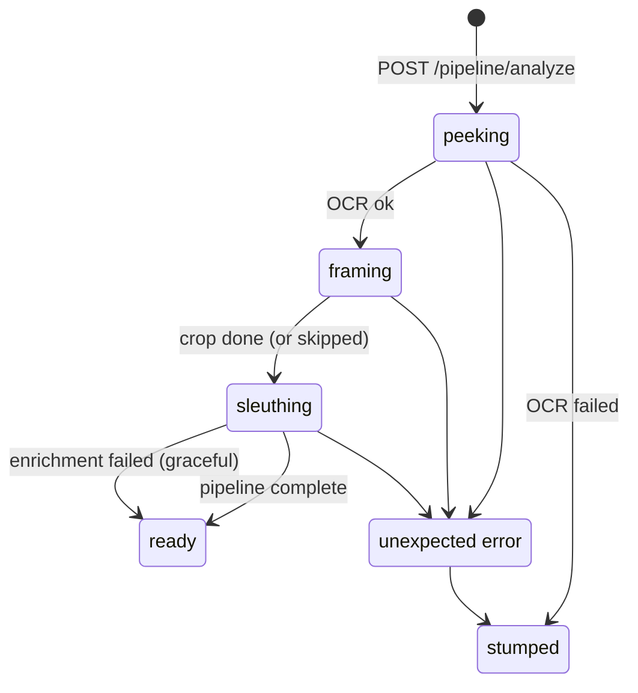
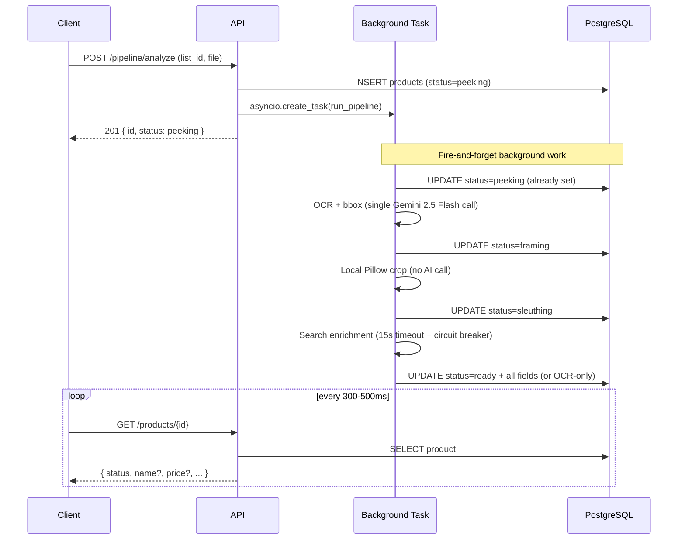

## Endpoint

```http
POST /pipeline/analyze
```

## Overview

`POST /pipeline/analyze` is the main ingestion endpoint. It creates a
`Product` row in status `peeking` and returns a `201 Created` in under
500&nbsp;ms, then runs the full enrichment pipeline **in the background**
(OCR &rarr; smart crop &rarr; search enrichment &rarr; merge). Clients track
progress by polling [`GET /products/{id}`](/api-reference/products).

<Note>
  The endpoint used to be synchronous (&#126;10&#8209;18&nbsp;s). As of the
  optimistic pipeline refactor it returns immediately. Share-sheet imports
  no longer time out and gallery batch imports are trivially parallel.

  Concurrent submits also run in real parallel inside the worker:
  every blocking SDK call (Gemini, Pillow) is wrapped in
  `asyncio.to_thread`, so N simultaneous pipelines no longer serialize
  on the event loop.
</Note>

## Request

### Authentication

```http
Authorization: Bearer <access_token>
```

Obtain a token via [`POST /auth/login`](/api-reference/authentication).

### Headers

```http
Content-Type: multipart/form-data
```

### Body (multipart/form-data)

<ParamField body="list_id" type="integer" required>
  ID of the list/board the resulting product should be attached to. Must be
  owned by the authenticated user.
</ParamField>

<ParamField body="file" type="file" required>
  Product screenshot. Accepted formats: HEIC, JPEG, PNG, WebP. Maximum
  size: **10&nbsp;MB**.
</ParamField>

### cURL

<CodeGroup>
```bash cURL
curl -X POST "http://localhost:8000/pipeline/analyze" \
  -H "Authorization: Bearer $TOKEN" \
  -F "list_id=1" \
  -F "file=@screenshot.jpg"
```

```python Python
import requests

resp = requests.post(
    "http://localhost:8000/pipeline/analyze",
    headers={"Authorization": f"Bearer {TOKEN}"},
    data={"list_id": 1},
    files={"file": open("screenshot.jpg", "rb")},
)
resp.raise_for_status()
product_id = resp.json()["id"]
```

```javascript JavaScript
const formData = new FormData();
formData.append("list_id", "1");
formData.append("file", fileInput.files[0]);

const res = await fetch("http://localhost:8000/pipeline/analyze", {
  method: "POST",
  headers: { Authorization: `Bearer ${token}` },
  body: formData,
});

const { id: productId } = await res.json();
```
</CodeGroup>

## Response — 201 Created

Returned immediately. Most fields are `null` at this point; they get filled
in by the background pipeline and observable via polling.

```json
{
  "id": 42,
  "status": "peeking",
  "name": null,
  "price": null,
  "currency": null,
  "description": null,
  "image_url": null,
  "merchant": null,
  "product_url": null,
  "category": null,
  "tags": null,
  "object_type": null,
  "error_message": null,
  "created_at": "2026-04-25T02:39:26.359572-07:00"
}
```

<ParamField body="id" type="integer">
  Product ID. Store it client-side — it is the key to poll the pipeline
  progress via `GET /products/{id}`.
</ParamField>

<ParamField body="status" type="string">
  Always `"peeking"` in the initial response. See [Status
  lifecycle](#status-lifecycle) below.
</ParamField>

<ParamField body="error_message" type="string | null">
  Only populated if the pipeline terminates in `stumped` status.
</ParamField>

## Status lifecycle

Every product created by this endpoint moves through these states:

| Status      | Meaning                                                                                 |
| ----------- | --------------------------------------------------------------------------------------- |
| `peeking`   | Row just created, unified OCR + bbox call running (Gemini 2.5 Flash).                   |
| `framing`   | OCR + bbox succeeded, local Pillow crop running. Near-instant (&lt;100&nbsp;ms).            |
| `sleuthing` | Crop done, merchant search + scraping running. Hard-capped at 15&nbsp;s.                 |
| `ready`     | Pipeline completed. Product fields populated. (May be OCR-only if enrichment fell back.) |
| `stumped`   | Pipeline failed. `error_message` describes why. See [Failure modes](#failure-modes).    |

<Frame>

```mermaid
stateDiagram-v2
    [*] --> peeking: POST /pipeline/analyze
    peeking --> framing: OCR ok
    framing --> sleuthing: crop done (or skipped)
    sleuthing --> ready: pipeline complete
    peeking --> stumped: OCR failed
    sleuthing --> ready: enrichment failed (graceful)
    state "unexpected error" as err
    peeking --> err
    framing --> err
    sleuthing --> err
    err --> stumped
```
</Frame>

## Polling

Once you have the `product_id`, poll `GET /products/{id}` until `status`
is `ready` or `stumped`. A cadence of 300&ndash;500&nbsp;ms is a good
default for the in-app camera flow.

```bash
PID=42
while :; do
  status=$(curl -s "http://localhost:8000/products/$PID" \
    -H "Authorization: Bearer $TOKEN" | jq -r .status)
  echo "$(date +%H:%M:%S) $status"
  [[ "$status" == "ready" || "$status" == "stumped" ]] && break
  sleep 0.5
done
```

<Tip>
  For a nicer mobile UX, a dedicated Server-Sent Events stream is planned
  (`GET /products/{id}/stream`, ticket I038). For now, HTTP polling is the
  supported mechanism.
</Tip>

See the full [`GET /products/{id}`](/api-reference/products) reference for
the shape of the polled response.

## Sequence diagram

<Frame>

```mermaid
sequenceDiagram
    participant Client
    participant API
    participant BG as Background Task
    participant DB as PostgreSQL

    Client->>API: POST /pipeline/analyze (list_id, file)
    API->>DB: INSERT products (status=peeking)
    API->>BG: asyncio.create_task(run_pipeline)
    API-->>Client: 201 { id, status: peeking }

    Note over BG,DB: Fire-and-forget background work

    BG->>DB: UPDATE status=peeking (already set)
    BG->>BG: OCR + bbox (single Gemini 2.5 Flash call)
    BG->>DB: UPDATE status=framing
    BG->>BG: Local Pillow crop (no AI call)
    BG->>DB: UPDATE status=sleuthing
    BG->>BG: Search enrichment (15s timeout + circuit breaker)
    BG->>DB: UPDATE status=ready + all fields (or OCR-only)

    loop every 300-500ms
        Client->>API: GET /products/{id}
        API->>DB: SELECT product
        API-->>Client: { status, name?, price?, ... }
    end
```
</Frame>

## Failure modes

Errors that happen **before** the background task is spawned are
reported synchronously with a 4xx/5xx HTTP status. Errors that happen
**inside** the pipeline leave the product in `stumped` state and return
via polling.

### 401 Unauthorized

Missing or invalid bearer token.

### 403 Forbidden

The `list_id` does not belong to the authenticated user.

### 404 Not Found

The `list_id` does not exist.

### 413 Content Too Large

File exceeds 10&nbsp;MB. No product row is created.

```json
{ "detail": "File is too large. Maximum allowed size is 10MB." }
```

### 500 Internal Server Error

Failure to persist the optimistic product row (rare — usually a DB
connectivity issue). No product row is created.

### `status = "stumped"` (returned via polling)

The background pipeline could not complete. Inspect `error_message`.
The most common cause is OCR being unable to extract a product name from
the image (blurry, unrelated content, unreadable text, unsupported
HEIC&nbsp;/&nbsp;CODEC).

```json
{
  "id": 42,
  "status": "stumped",
  "error_message": "OCR failed: cannot identify image file",
  "name": null,
  ...
}
```

<Note>
  Crop and search enrichment failures are treated as graceful
  degradation: the product still reaches `ready`, just with an image
  from the original upload and/or without enriched metadata. Only OCR
  failure produces `stumped`.

  Enrichment falls back to OCR-only data on three signals: timeout
  (>15&nbsp;s, enforced via `asyncio.wait_for`), exception, or an open
  circuit breaker (3 consecutive failures → 60&nbsp;s skip). Clients
  can detect OCR-only products by the absence of
  `search_confidence:<n>` in the `tags` field.
</Note>

## Durability caveat (MVP)

<Warning>
  Background tasks are scheduled with `asyncio.create_task` and are
  **not persisted across server restarts**. If the server restarts while
  a product is still in `peeking`&nbsp;/&nbsp;`framing`&nbsp;/&nbsp;`sleuthing`,
  that product will be orphaned in an intermediate status. Ticket I039
  will introduce a durable job queue (Redis + worker) when scale demands
  it.
</Warning>

## Supported image formats

<CardGroup cols={2}>
  <Card title="HEIC" icon="mobile-screen">
    iOS screenshots (primary use case)
  </Card>
  <Card title="JPEG" icon="image">
    Standard JPEG images
  </Card>
  <Card title="PNG" icon="image">
    PNG images
  </Card>
  <Card title="WebP" icon="image">
    WebP format
  </Card>
</CardGroup>

## Testing locally

```bash
# 1. Get a token
TOKEN=$(curl -s -X POST http://localhost:8000/auth/login \
  -H "Content-Type: application/json" \
  -d '{"username":"you@example.com","password":"..."}' | jq -r .access_token)

# 2. Create a list
LIST_ID=$(curl -s -X POST http://localhost:8000/lists/ \
  -H "Authorization: Bearer $TOKEN" \
  -H "Content-Type: application/json" \
  -d '{"name":"Test"}' | jq -r .id)

# 3. Submit an image (returns 201 in <500ms)
PID=$(curl -s -X POST http://localhost:8000/pipeline/analyze \
  -H "Authorization: Bearer $TOKEN" \
  -F "list_id=$LIST_ID" \
  -F "file=@screenshot.jpg" | jq -r .id)

# 4. Poll until ready
while :; do
  resp=$(curl -s "http://localhost:8000/products/$PID" \
    -H "Authorization: Bearer $TOKEN")
  status=$(echo "$resp" | jq -r .status)
  echo "$(date +%H:%M:%S) $status"
  [[ "$status" == "ready" || "$status" == "stumped" ]] && echo "$resp" | jq && break
  sleep 0.5
done
```

## Next steps

- [`GET /products/{id}`](/api-reference/products) — polling reference.
- [Authentication](/api-reference/authentication) — how to obtain a token.
- [Architecture](/architecture) — pipeline internals.
