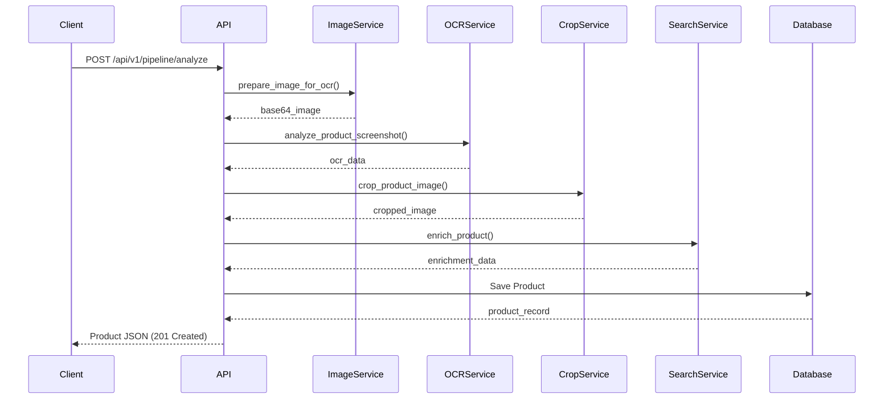

## Overview

Entropi follows a **pipeline architecture** where each service processes the data sequentially, transforming a raw screenshot into a structured product record.

## Pipeline Flow

## Detailed Pipeline

<Steps>
  <Step title="1. Image Service">
    **Input**: Raw image bytes (HEIC/JPEG/PNG)  
    **Output**: Base64-encoded JPEG  
    **Purpose**: Convert and optimize images for AI processing
    
    - Converts HEIC → JPEG
    - Resizes to max 2048x2048px
    - Optimizes quality (95% JPEG)
    - Encodes to base64
  </Step>

  <Step title="2. OCR Service">
    **Input**: Base64 image  
    **Output**: Structured product data (JSON)  
    **Purpose**: Extract product information from screenshot
    
    - Uses Groq Llama 4 Vision
    - Extracts: name, price, currency, description, merchant, category, tags, object_type
    - Returns structured JSON
  </Step>

  <Step title="3. Crop Service">
    **Input**: Base64 image + OCR context  
    **Output**: Cropped base64 image  
    **Purpose**: Focus on the main product
    
    - Uses Gemini 2.0 Flash for bounding box detection
    - Detects product location using OCR hints
    - Crops with 20% padding
    - Falls back to original if detection fails
  </Step>

  <Step title="4. Search Enrichment">
    **Input**: OCR data + cropped image  
    **Output**: Enriched product data  
    **Purpose**: Find merchant URL and scrape additional data
    
    - Gemini searches for product URL
    - Function calling triggers web scraping
    - Validates results with confidence scoring
    - Merges with OCR data
  </Step>

  <Step title="5. Database Storage">
    **Input**: Merged product data  
    **Output**: Product record with ID  
    **Purpose**: Persist product information
    
    - Saves to PostgreSQL `products` table
    - Returns full product object
    - Supports relationships with lists
  </Step>
</Steps>

## Service Architecture

<CardGroup cols={2}>
  <Card title="Image Service" icon="image">
    **File**: `app/services/image_service.py`  
    **Dependencies**: Pillow, pillow-heif  
    **Stateless**: ✅ Yes
  </Card>

  <Card title="OCR Service" icon="eye">
    **File**: `app/services/ocr_service.py`  
    **Dependencies**: Groq API, OpenAI SDK  
    **Stateless**: ✅ Yes
  </Card>

  <Card title="Crop Service" icon="crop">
    **File**: `app/services/image_crop_service.py`  
    **Dependencies**: Gemini API, Pillow  
    **Stateless**: ✅ Yes
  </Card>

  <Card title="Search Enrichment" icon="magnifying-glass">
    **File**: `app/services/search_enrichement/`  
    **Dependencies**: Gemini API, Web Scraping  
    **Stateless**: ✅ Yes
  </Card>
</CardGroup>

## Data Flow Diagram

## Error Handling

Each service implements **graceful degradation**:

<AccordionGroup>
  <Accordion title="Image Service Failures">
    Returns HTTP 422 if conversion fails. Client must provide valid image format.
  </Accordion>

  <Accordion title="OCR Failures">
    Returns HTTP 422 if OCR cannot extract product name. Pipeline stops here.
  </Accordion>

  <Accordion title="Crop Failures">
    Falls back to original image. Pipeline continues with uncropped image.
  </Accordion>

  <Accordion title="Search Enrichment Failures">
    Falls back to OCR-only data. Product is saved with OCR data only.
  </Accordion>
</AccordionGroup>

## Technology Stack

<CardGroup cols={3}>
  <Card title="FastAPI" icon="code">
    Modern Python web framework
  </Card>
  <Card title="PostgreSQL" icon="database">
    Relational database
  </Card>
  <Card title="SQLAlchemy" icon="database">
    ORM for database operations
  </Card>
  <Card title="Groq" icon="brain">
    Llama 4 Vision for OCR
  </Card>
  <Card title="Gemini" icon="brain">
    Flash & Pro for detection & search
  </Card>
  <Card title="Pillow" icon="image">
    Image processing library
  </Card>
</CardGroup>

## Performance Considerations

<Warning>
  The pipeline is **sequential** by design. Each step depends on the previous one's output. Parallelization is not currently supported.
</Warning>

**Typical Processing Times**:
- Image conversion: ~200ms
- OCR extraction: ~3-5s
- Smart cropping: ~2-3s
- Search enrichment: ~5-10s
- **Total**: ~10-18s per request

<Tip>
  For production, consider implementing:
  - Async task queues (Celery, RQ)
  - Caching for repeated products
  - Rate limiting on AI API calls
</Tip>

## Next Steps

- Learn about the [Database Schema](/database)
- Explore individual [Services](/services/overview)
- Check the [API Reference](/api-reference/analyze)

