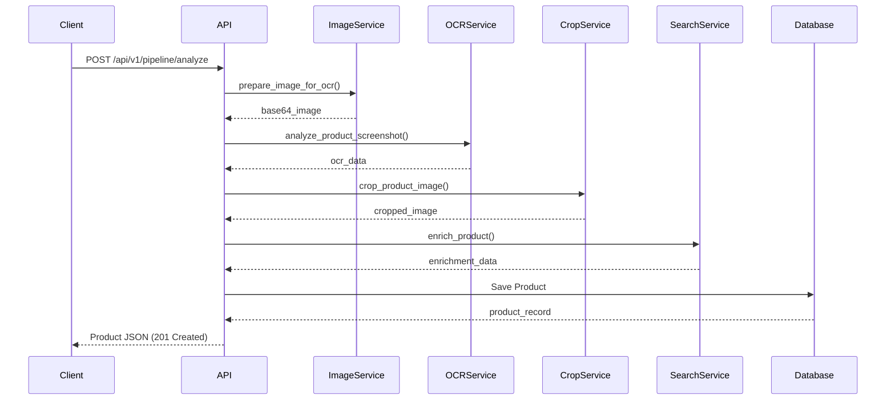

Entropi follows a pipeline architecture where each service processes the data sequentially, transforming a raw screenshot into a structured product record.

## Pipeline Flow

## Pipeline Steps

### 1. Image Service

**Input**: Raw image bytes (HEIC/JPEG/PNG)  
**Output**: Base64-encoded JPEG  
**Purpose**: Convert and optimize images for AI processing

- Converts HEIC → JPEG
- Resizes to max 2048x2048px
- Optimizes quality (95% JPEG)
- Encodes to base64

### 2. OCR Service

**Input**: Base64 image  
**Output**: Structured product data (JSON)  
**Purpose**: Extract product information from screenshot

- Uses Groq Llama 4 Vision
- Extracts: name, price, currency, description, merchant, category, tags, object_type
- Returns structured JSON

### 3. Crop Service

**Input**: Base64 image + OCR context  
**Output**: Cropped base64 image  
**Purpose**: Focus on the main product

- Uses Gemini 2.0 Flash for bounding box detection
- Detects product location using OCR hints
- Crops with 20% padding
- Falls back to original if detection fails

### 4. Search Enrichment

**Input**: OCR data + cropped image  
**Output**: Enriched product data  
**Purpose**: Find merchant URL and scrape additional data

- Gemini searches for product URL
- Function calling triggers web scraping
- Validates results with confidence scoring
- Merges with OCR data

### 5. Database Storage

**Input**: Merged product data  
**Output**: Product record with ID  
**Purpose**: Persist product information

- Saves to PostgreSQL `products` table
- Returns full product object
- Supports relationships with lists

## Service Architecture

| Service | File | Dependencies | Stateless |
|---------|------|--------------|-----------|
| Image Service | `app/services/image_service.py` | Pillow, pillow-heif | Yes |
| OCR Service | `app/services/ocr_service.py` | Groq API, OpenAI SDK | Yes |
| Crop Service | `app/services/image_crop_service.py` | Gemini API, Pillow | Yes |
| Search Enrichment | `app/services/search_enrichement/` | Gemini API, Web Scraping | Yes |

## Data Flow

## Error Handling

Each service implements graceful degradation:

| Service | Failure Behavior |
|---------|------------------|
| Image Service | Returns HTTP 422 if conversion fails. Client must provide valid image format. |
| OCR Service | Returns HTTP 422 if OCR cannot extract product name. Pipeline stops here. |
| Crop Service | Falls back to original image. Pipeline continues with uncropped image. |
| Search Enrichment | Falls back to OCR-only data. Product is saved with OCR data only. |

## Technology Stack

| Technology | Purpose |
|------------|---------|
| FastAPI | Modern Python web framework |
| PostgreSQL | Relational database |
| SQLAlchemy | ORM for database operations |
| Groq | Llama 4 Vision for OCR |
| Gemini | Flash & Pro for detection & search |
| Pillow | Image processing library |

## Performance

The pipeline is sequential by design. Each step depends on the previous one's output. Parallelization is not currently supported.

**Typical Processing Times**:
- Image conversion: ~200ms
- OCR extraction: ~3-5s
- Smart cropping: ~2-3s
- Search enrichment: ~5-10s
- **Total**: ~10-18s per request

<Note>
  For production, consider implementing async task queues (Celery, RQ), caching for repeated products, and rate limiting on AI API calls.
</Note>

## Related Resources

- [Database Schema](/database)
- [Services Overview](/services/overview)
- [API Reference](/api-reference/analyze)
