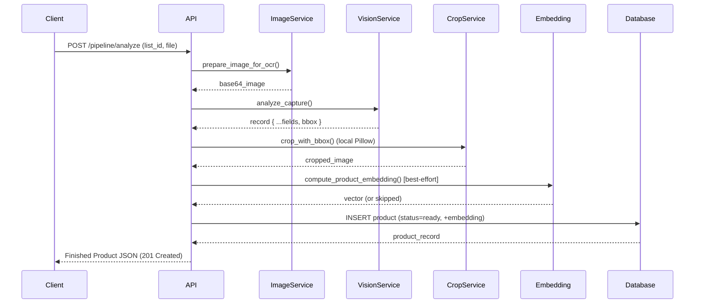

## Overview

Entropi follows a **synchronous pipeline architecture**: each service processes the data sequentially, transforming a raw capture into a structured, search-indexed product record — all within a single HTTP request. There is no background task, no queue, and no polling.

## Pipeline Flow

```mermaid
graph LR
    A[Image Upload] --> B[Image Service]
    B --> C[Vision Service]
    C --> D[Local Crop]
    D --> E[Embedding]
    E --> F[Database]
    F --> G[Finished Product JSON]

    style A fill:#000000,color:#FFFFFF
    style G fill:#000000,color:#FFFFFF
```

## Detailed Pipeline

<Steps>
  <Step title="1. Image Service">
    **Input**: Raw image bytes (HEIC/JPEG/PNG/WebP)
    **Output**: Base64-encoded JPEG
    **Purpose**: Convert and optimize images for AI processing

    - Converts HEIC → JPEG
    - Resizes to max 2048×2048px
    - Optimizes quality (95% JPEG)
    - Encodes to base64

    Runs before the timeout window so the decoded raw photo is always
    available for the best-effort `stumped` fallback.
  </Step>

  <Step title="2. Vision Service (single Gemini call)">
    **Input**: Base64 image
    **Output**: Structured lifestyle record (JSON) + normalized bbox
    **Purpose**: Understand the image in one shot

    - One Gemini 2.5 Flash multimodal call via `analyze_capture()`
    - Object recognition + text reading + structured JSON + bounding box
    - Returns `content_type`, `description`, `category`, `object_type`,
      `colors`, `style_tags`, `setting`, `brand` + `brand_confidence`
      (only when readable), `raw_text`, `price`, and
      `bbox: [ymin, xmin, ymax, xmax]` (0–1000 normalized, nullable)
    - No OCR engine or object detector on the side, no web
  </Step>

  <Step title="3. Local Crop">
    **Input**: Base64 image + bbox from step 2
    **Output**: Cropped base64 image
    **Purpose**: Focus on the main subject

    - Pure local Pillow operation (`crop_with_bbox()`) — no AI call
    - Crops with 20% padding (configurable)
    - Falls back to the original image on any failure (graceful degradation)
  </Step>

  <Step title="4. Embedding (best-effort)">
    **Input**: Composed record text + cropped image
    **Output**: A 1024-dim multimodal vector
    **Purpose**: Index the product for semantic search

    - One Voyage multimodal call (`compute_product_embedding()`)
    - Combines the record's text and the image into a single vector
    - Best-effort: a failure here leaves the product `ready` with a null
      embedding, to be picked up later by the retroactive backfill
  </Step>

  <Step title="5. Database Storage">
    **Input**: The finished record (+ embedding)
    **Output**: Product row in its terminal state
    **Purpose**: Persist the capture

    - Inserts one `products` row already in `ready` (or `stumped`)
    - Attaches it to the target list
    - Returns the full product object in the HTTP response
  </Step>
</Steps>

## Service Architecture

<CardGroup cols={2}>
  <Card title="Image Service" icon="image">
    **File**: `app/services/vision/image_service.py`
    **Dependencies**: Pillow, pillow-heif
    **Stateless**: Yes
  </Card>

  <Card title="Vision Service" icon="eye">
    **File**: `app/services/vision/vision_service.py`
    **Dependencies**: Gemini API (Gemini 2.5 Flash)
    **Stateless**: Yes
  </Card>

  <Card title="Crop Service" icon="crop">
    **File**: `app/services/vision/image_crop_service.py`
    **Dependencies**: Pillow (local only — no AI call)
    **Stateless**: Yes
  </Card>

  <Card title="Embedding Service" icon="vector-square">
    **File**: `app/services/embedding/`
    **Dependencies**: Voyage AI (multimodal embeddings)
    **Stateless**: Yes
  </Card>
</CardGroup>

## Data Flow Diagram

```mermaid
sequenceDiagram
    participant Client
    participant API
    participant ImageService
    participant VisionService
    participant CropService
    participant Embedding
    participant Database

    Client->>API: POST /pipeline/analyze (list_id, file)
    API->>ImageService: prepare_image_for_ocr()
    ImageService-->>API: base64_image

    API->>VisionService: analyze_capture()
    VisionService-->>API: record { ...fields, bbox }

    API->>CropService: crop_with_bbox() (local Pillow)
    CropService-->>API: cropped_image

    API->>Embedding: compute_product_embedding() [best-effort]
    Embedding-->>API: vector (or skipped)

    API->>Database: INSERT product (status=ready, +embedding)
    Database-->>API: product_record
    API-->>Client: Finished Product JSON (201 Created)
```

## Error Handling

Each service degrades gracefully; only a failure of understanding produces `stumped`:

<AccordionGroup>
  <Accordion title="Image Service failures">
    If the image cannot be decoded, the product is persisted as `stumped`
    with an `error_message`. The response is still `201` — capture never
    returns a blocking 5xx for a bad image.
  </Accordion>

  <Accordion title="Vision Service failures / timeout">
    If understanding returns nothing or the 45&nbsp;s cap is hit, the product
    is persisted as `stumped`, **keeping the raw photo** in `image_url`.
  </Accordion>

  <Accordion title="Crop failures">
    Falls back to the original image. The pipeline continues; status is
    still `ready`.
  </Accordion>

  <Accordion title="Embedding failures">
    Swallowed. The product stays `ready` with a null embedding and is
    re-indexed later by the backfill. Search simply excludes unindexed rows.
  </Accordion>
</AccordionGroup>

## Technology Stack

<CardGroup cols={3}>
  <Card title="FastAPI" icon="code">
    Modern async Python web framework
  </Card>
  <Card title="PostgreSQL + pgvector" icon="database">
    Relational database with vector search
  </Card>
  <Card title="SQLAlchemy (async)" icon="database">
    ORM for database operations
  </Card>
  <Card title="Gemini 2.5 Flash" icon="brain">
    Single multimodal understanding call
  </Card>
  <Card title="Voyage (multimodal-3)" icon="brain">
    Text + image embeddings for search
  </Card>
  <Card title="Pillow" icon="image">
    Local image processing
  </Card>
</CardGroup>

## Performance Considerations

Each pipeline run is sequential (every step consumes the previous step's output), but **concurrent captures run in real parallel**. All blocking SDK calls (Gemini, Voyage) are awaited and the Pillow work is offloaded via `asyncio.to_thread`, so N simultaneous `/pipeline/analyze` requests do not serialize on the event loop. Batch imports fan out concurrently (bounded).

**Typical processing times** (per capture):
- Image conversion: ~200&nbsp;ms
- Vision understanding (single Gemini call): ~3–5&nbsp;s
- Local Pillow crop: &lt;100&nbsp;ms
- Embedding: ~1–2&nbsp;s (best-effort)
- **Total**: ~4–8&nbsp;s end-to-end, hard-capped at 45&nbsp;s

<Tip>
  Perceived latency is handled on the client (a splash screen during the
  request), so the backend stays optimistic, linear, and in-process — no
  queue, Celery, or Redis.
</Tip>

## Next Steps

- Learn about the [Database Schema](/database)
- Explore individual [Services](/services/overview)
- Check the [API Reference](/api-reference/analyze)
