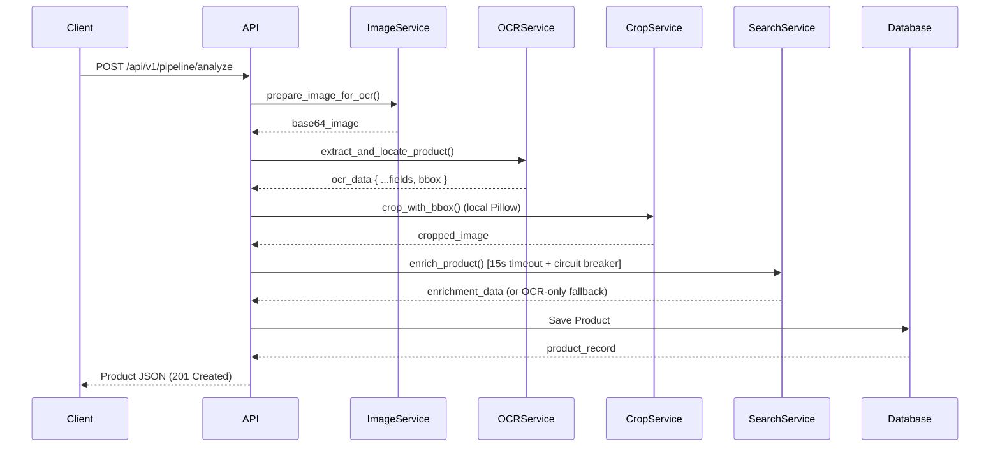

## Overview

Entropi follows a **pipeline architecture** where each service processes the data sequentially, transforming a raw screenshot into a structured product record.

## Pipeline Flow

```mermaid
graph LR
    A[Screenshot Upload] --> B[Image Service]
    B --> C[OCR + Bbox Service]
    C --> D[Local Crop]
    D --> E[Search Enrichment]
    E --> F[Database]
    F --> G[Product JSON]
    
    style A fill:#000000,color:#FFFFFF
    style G fill:#000000,color:#FFFFFF
```

## Detailed Pipeline

<Steps>
  <Step title="1. Image Service">
    **Input**: Raw image bytes (HEIC/JPEG/PNG)  
    **Output**: Base64-encoded JPEG  
    **Purpose**: Convert and optimize images for AI processing
    
    - Converts HEIC → JPEG
    - Resizes to max 2048x2048px
    - Optimizes quality (95% JPEG)
    - Encodes to base64
  </Step>

  <Step title="2. OCR + Bbox (single Gemini call)">
    **Input**: Base64 image  
    **Output**: Structured product data (JSON) + normalized bbox  
    **Purpose**: Extract product information AND locate it in one shot

    - Uses Gemini 2.5 Flash via `extract_and_locate_product()`
    - Extracts: name, price, currency, description, merchant, category, tags, object_type
    - Also returns `bbox: [ymin, xmin, ymax, xmax]` (0–1000 normalized, nullable)
    - Replaces the previous two-call flow (OCR then bbox), saving ~3 seconds
  </Step>

  <Step title="3. Local Crop">
    **Input**: Base64 image + bbox from step 2  
    **Output**: Cropped base64 image  
    **Purpose**: Focus on the main product

    - Pure local Pillow operation (`crop_with_bbox()`) — no AI call
    - Crops with 20% padding (configurable)
    - Falls back to the original image on any failure (graceful degradation)
  </Step>

  <Step title="4. Search Enrichment">
    **Input**: OCR data + cropped image  
    **Output**: Enriched product data  
    **Purpose**: Find merchant URL and scrape additional data

    - Gemini searches for product URL
    - Function calling triggers web scraping
    - Validates results with confidence scoring
    - Merges with OCR data
    - Wrapped in a 15&nbsp;s `asyncio.wait_for` timeout and protected by a circuit breaker (see [Resilience](/services/search-enrichment#resilience))
    - On timeout, exception, or open breaker: falls back to OCR-only data; product still reaches `ready`
  </Step>

  <Step title="5. Database Storage">
    **Input**: Merged product data  
    **Output**: Product record with ID  
    **Purpose**: Persist product information
    
    - Saves to PostgreSQL `products` table
    - Returns full product object
    - Supports relationships with lists
  </Step>
</Steps>

## Service Architecture

<CardGroup cols={2}>
  <Card title="Image Service" icon="image">
    **File**: `app/services/image_service.py`  
    **Dependencies**: Pillow, pillow-heif  
    **Stateless**: Yes
  </Card>

  <Card title="OCR + Bbox Service" icon="eye">
    **File**: `app/services/vision/ocr_service.py`  
    **Dependencies**: Gemini API (Gemini 2.5 Flash), Pillow  
    **Stateless**: Yes
  </Card>

  <Card title="Crop Service" icon="crop">
    **File**: `app/services/vision/image_crop_service.py`  
    **Dependencies**: Pillow (local only — no AI call)  
    **Stateless**: Yes
  </Card>

  <Card title="Search Enrichment" icon="magnifying-glass">
    **File**: `app/services/search/`  
    **Dependencies**: Gemini API, Web Scraping  
    **Stateless**: Yes — circuit-breaker state is process-local
  </Card>
</CardGroup>

## Data Flow Diagram

```mermaid
sequenceDiagram
    participant Client
    participant API
    participant ImageService
    participant OCRService
    participant CropService
    participant SearchService
    participant Database

    Client->>API: POST /api/v1/pipeline/analyze
    API->>ImageService: prepare_image_for_ocr()
    ImageService-->>API: base64_image

    API->>OCRService: extract_and_locate_product()
    OCRService-->>API: ocr_data { ...fields, bbox }

    API->>CropService: crop_with_bbox() (local Pillow)
    CropService-->>API: cropped_image

    API->>SearchService: enrich_product() [15s timeout + circuit breaker]
    SearchService-->>API: enrichment_data (or OCR-only fallback)
    
    API->>Database: Save Product
    Database-->>API: product_record
    API-->>Client: Product JSON (201 Created)
```

## Error Handling

Each service implements **graceful degradation**:

<AccordionGroup>
  <Accordion title="Image Service Failures">
    Returns HTTP 422 if conversion fails. Client must provide valid image format.
  </Accordion>

  <Accordion title="OCR Failures">
    Returns HTTP 422 if OCR cannot extract product name. Pipeline stops here.
  </Accordion>

  <Accordion title="Crop Failures">
    Falls back to original image. Pipeline continues with uncropped image.
  </Accordion>

  <Accordion title="Search Enrichment Failures">
    Falls back to OCR-only data. Product is saved with OCR data only.
    Triggered by: enrichment timeout (>15&nbsp;s), exception, or an open
    circuit breaker (3 consecutive failures → 60&nbsp;s skip window).
    Low-confidence results (&lt;90%) are also dropped but do **not** trip
    the breaker.
  </Accordion>
</AccordionGroup>

## Technology Stack

<CardGroup cols={3}>
  <Card title="FastAPI" icon="code">
    Modern Python web framework
  </Card>
  <Card title="PostgreSQL" icon="database">
    Relational database
  </Card>
  <Card title="SQLAlchemy" icon="database">
    ORM for database operations
  </Card>
  <Card title="Gemini 2.5 Flash" icon="brain">
    Unified OCR + bbox extraction
  </Card>
  <Card title="Gemini (grounded search)" icon="brain">
    Merchant URL search & function calling
  </Card>
  <Card title="Pillow" icon="image">
    Image processing library
  </Card>
</CardGroup>

## Performance Considerations

Each pipeline run is sequential (every step consumes the previous step's
output), but **concurrent submits run in real parallel**. All blocking
SDK calls (Gemini, Pillow) are wrapped in `asyncio.to_thread`, so N
simultaneous `/pipeline/analyze` requests no longer serialize on the
event loop.

**Typical processing times** (per pipeline run):
- Image conversion: ~200&nbsp;ms
- OCR + bbox (single Gemini call): ~3–4&nbsp;s
- Local Pillow crop: &lt;100&nbsp;ms
- Search enrichment: ~3–10&nbsp;s (hard-capped at 15&nbsp;s; falls back to OCR-only on timeout/breaker)
- **Total**: ~6–14&nbsp;s end-to-end (down from ~10–18&nbsp;s pre-I032)

<Tip>
  For production, consider implementing:
  - Async task queues (Celery, RQ)
  - Caching for repeated products
  - Rate limiting on AI API calls
</Tip>

## Next Steps

- Learn about the [Database Schema](/database)
- Explore individual [Services](/services/overview)
- Check the [API Reference](/api-reference/analyze)

