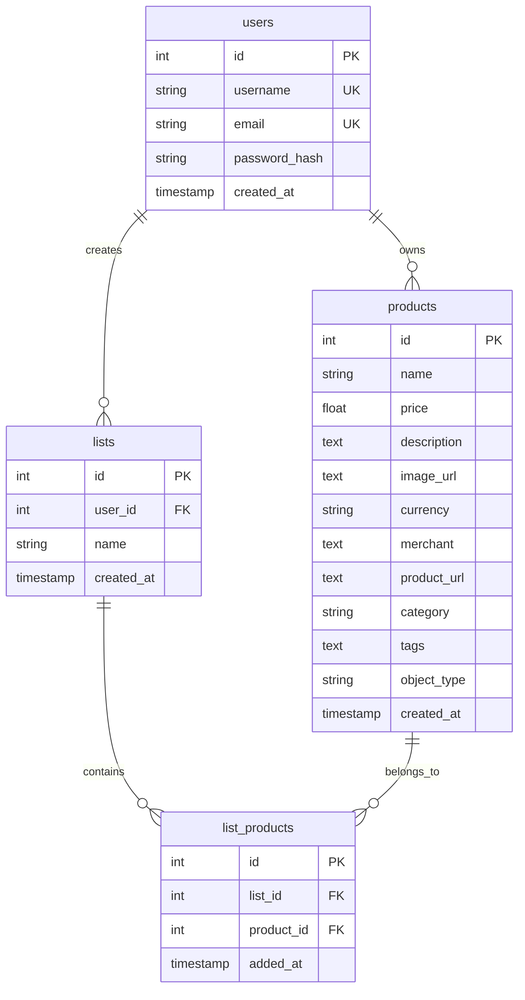

## Overview

Entropi uses **PostgreSQL** as its primary database, managed through **SQLAlchemy 2.0** ORM and **Alembic** for migrations.

## Entity Relationship Diagram



## Core Tables

### Users Table

Stores user accounts and authentication information.

<ParamField body="id" type="integer" required>
  Primary key, auto-increment
</ParamField>
<ParamField body="username" type="string" required>
  Unique username
</ParamField>
<ParamField body="email" type="string" required>
  Unique email address
</ParamField>
<ParamField body="password_hash" type="string">
  Hashed password (Argon2)
</ParamField>
<ParamField body="created_at" type="timestamp">
  Account creation timestamp
</ParamField>

**SQL Schema**:
```sql
CREATE TABLE users (
    id SERIAL PRIMARY KEY,
    username VARCHAR UNIQUE NOT NULL,
    email VARCHAR UNIQUE NOT NULL,
    password_hash VARCHAR,
    created_at TIMESTAMP WITH TIME ZONE DEFAULT now()
);
```

### Products Table

The core table storing all extracted product information.

<ParamField body="id" type="integer" required>
  Primary key, auto-increment
</ParamField>
<ParamField body="name" type="string" required>
  Product name (from OCR)
</ParamField>
<ParamField body="price" type="float" required>
  Product price (numeric)
</ParamField>
<ParamField body="description" type="text">
  Product description (from OCR or enrichment)
</ParamField>
<ParamField body="image_url" type="text">
  Base64-encoded cropped product image
</ParamField>
<ParamField body="currency" type="string(3)" required>
  Currency code (EUR, USD, etc.) - defaults to EUR
</ParamField>
<ParamField body="merchant" type="text">
  Brand or merchant name
</ParamField>
<ParamField body="product_url" type="text">
  Merchant product URL (from enrichment)
</ParamField>
<ParamField body="category" type="string">
  Product category
</ParamField>
<ParamField body="tags" type="text">
  Comma-separated tags
</ParamField>
<ParamField body="object_type" type="string">
  Object type (e.g., "leather jacket", "sunglasses")
</ParamField>
<ParamField body="created_at" type="timestamp">
  Product creation timestamp
</ParamField>

**SQL Schema**:
```sql
CREATE TABLE products (
    id SERIAL PRIMARY KEY,
    name VARCHAR NOT NULL,
    price FLOAT NOT NULL,
    description TEXT,
    image_url TEXT,
    currency VARCHAR(3) NOT NULL DEFAULT 'EUR',
    merchant TEXT,
    product_url TEXT,
    category VARCHAR,
    tags TEXT,
    object_type VARCHAR,
    created_at TIMESTAMP WITH TIME ZONE DEFAULT now()
);
```

### Lists Table

User-created collections of products.

<ParamField body="id" type="integer" required>
  Primary key
</ParamField>
<ParamField body="user_id" type="integer" required>
  Foreign key to users.id
</ParamField>
<ParamField body="name" type="string" required>
  List name
</ParamField>
<ParamField body="created_at" type="timestamp">
  List creation timestamp
</ParamField>

**SQL Schema**:
```sql
CREATE TABLE lists (
    id SERIAL PRIMARY KEY,
    user_id INTEGER REFERENCES users(id),
    name VARCHAR NOT NULL,
    created_at TIMESTAMP WITH TIME ZONE DEFAULT now()
);
```

### List Products Table

Many-to-many relationship between lists and products.

<ParamField body="id" type="integer" required>
  Primary key
</ParamField>
<ParamField body="list_id" type="integer" required>
  Foreign key to lists.id
</ParamField>
<ParamField body="product_id" type="integer" required>
  Foreign key to products.id
</ParamField>
<ParamField body="added_at" type="timestamp">
  When product was added to list
</ParamField>

**SQL Schema**:
```sql
CREATE TABLE list_products (
    id SERIAL PRIMARY KEY,
    list_id INTEGER REFERENCES lists(id),
    product_id INTEGER REFERENCES products(id),
    added_at TIMESTAMP WITH TIME ZONE DEFAULT now()
);
```

## Relationships

<CardGroup cols={2}>
  <Card title="Users → Lists" icon="users">
    One-to-many: A user can create multiple lists
  </Card>
  <Card title="Lists ↔ Products" icon="list">
    Many-to-many: Products can belong to multiple lists
  </Card>
</CardGroup>

## Indexes

Recommended indexes for performance:

```sql
-- Products table
CREATE INDEX idx_products_name ON products(name);
CREATE INDEX idx_products_category ON products(category);
CREATE INDEX idx_products_created_at ON products(created_at DESC);

-- Lists table
CREATE INDEX idx_lists_user_id ON lists(user_id);

-- List products table
CREATE INDEX idx_list_products_list_id ON list_products(list_id);
CREATE INDEX idx_list_products_product_id ON list_products(product_id);
```

## Query Examples

### Get All Products

```python
from app.models.product import Product
from app.database import SessionLocal

db = SessionLocal()
products = db.query(Product).all()
```

### Get Products by Category

```python
products = db.query(Product).filter(Product.category == "Electronics").all()
```

### Get Products in a List

```python
from app.models.list_product import ListProduct

list_products = (
    db.query(Product)
    .join(ListProduct)
    .filter(ListProduct.list_id == list_id)
    .all()
)
```

### Search Products by Name

```python
search_term = "jacket"
products = (
    db.query(Product)
    .filter(Product.name.ilike(f"%{search_term}%"))
    .all()
)
```

## Migrations

Entropi uses **Alembic** for database migrations. Migrations are located in `alembic/versions/`.

<Steps>
  <Step title="Create Migration">
    ```bash
    alembic revision --autogenerate -m "description"
    ```
  </Step>

  <Step title="Review Migration">
    Check the generated migration file in `alembic/versions/`
  </Step>

  <Step title="Apply Migration">
    ```bash
    alembic upgrade head
    ```
  </Step>
</Steps>

<Warning>
  Always review auto-generated migrations before applying them in production!
</Warning>

## Data Types

<CardGroup cols={2}>
  <Card title="Text Fields" icon="text">
    - `name`: VARCHAR (variable length)
    - `description`: TEXT (unlimited length)
    - `image_url`: TEXT (base64 can be large)
  </Card>
  <Card title="Numeric Fields" icon="hashtag">
    - `price`: FLOAT (supports decimals)
    - `id`: SERIAL (auto-increment integer)
  </Card>
  <Card title="Timestamps" icon="clock">
    - `created_at`: TIMESTAMP WITH TIME ZONE
    - `added_at`: TIMESTAMP WITH TIME ZONE
  </Card>
  <Card title="Constraints" icon="lock">
    - UNIQUE: username, email
    - NOT NULL: name, price, currency
    - FOREIGN KEY: user_id, list_id, product_id
  </Card>
</CardGroup>

## Next Steps

- Explore the [API Reference](/api-reference/analyze) to see how products are created
- Learn about [Services](/services/overview) that interact with the database

