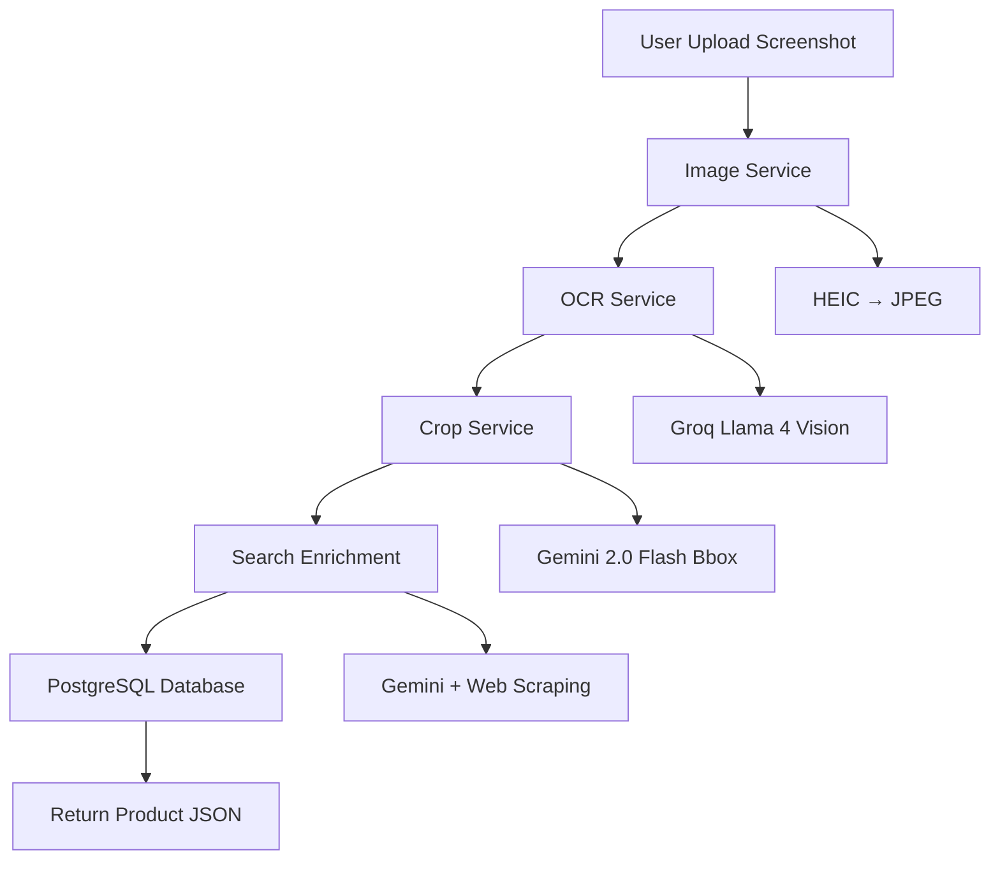

<CardGroup cols={2}>
  <Card
    title="🚀 Quick Start"
    icon="rocket"
    href="/setup/installation"
  >
    Get up and running in minutes
  </Card>
  <Card
    title="📖 API Reference"
    icon="book"
    href="/api-reference/analyze"
  >
    Explore all endpoints
  </Card>
  <Card
    title="🏗️ Architecture"
    icon="diagram-project"
    href="/architecture"
  >
    Understand the system design
  </Card>
  <Card
    title="🔧 Services"
    icon="gears"
    href="/services/overview"
  >
    Learn about each service
  </Card>
</CardGroup>

## What is Entropi?

**Entropi** is an AI-powered API that extracts product information from mobile screenshots. Simply upload a screenshot of a product (from Instagram, TikTok, e-commerce sites, etc.), and Entropi will:

- **Extract** product details (name, price, description, merchant)
- **Crop** the product image intelligently
- **Enrich** data with web scraping and search
- **Store** everything in a structured database

## Key Features

<AccordionGroup>
  <Accordion title="📸 Multi-Format Support">
    Supports HEIC (iOS), JPEG, PNG, and WebP formats. Automatically converts and optimizes images for AI processing.
  </Accordion>

  <Accordion title="🤖 AI-Powered OCR">
    Uses Groq's Llama 4 Vision model to extract structured product data from screenshots with high accuracy.
  </Accordion>

  <Accordion title="✂️ Smart Cropping">
    Gemini 2.0 Flash detects and crops the main product from screenshots, removing UI elements and focusing on the product itself.
  </Accordion>

  <Accordion title="🔍 Search Enrichment">
    Automatically searches for product URLs and scrapes additional images and metadata using Gemini's function calling.
  </Accordion>

  <Accordion title="💾 PostgreSQL Storage">
    All products are stored in a PostgreSQL database with full relational support for lists and collections.
  </Accordion>
</AccordionGroup>

## Use Cases

<CardGroup cols={3}>
  <Card title="🛍️ E-commerce" icon="shopping-cart">
    Extract product information from shopping screenshots
  </Card>
  <Card title="📱 Social Media" icon="mobile-screen">
    Save products discovered on Instagram, TikTok, or Pinterest
  </Card>
  <Card title="📋 Wishlists" icon="list">
    Build and manage product collections
  </Card>
</CardGroup>

## How It Works

## Tech Stack

- **Framework**: FastAPI 0.110+
- **Database**: PostgreSQL 14+ with SQLAlchemy 2.0
- **AI Services**:
  - Groq (Llama 4 Vision) - OCR extraction
  - Gemini 2.0 Flash - Bounding box detection
  - Gemini Pro - Search and function calling
- **Image Processing**: Pillow with HEIC support
- **Authentication**: JWT (python-jose)

## Next Steps

Ready to get started? Check out the [Installation Guide](/setup/installation) to set up your environment, or jump straight to the [API Reference](/api-reference/analyze) to see how to use the endpoints.

<Note>
  This is the **V1 (MVP)** version of Entropi API. Some features may be experimental or subject to change.
</Note>

