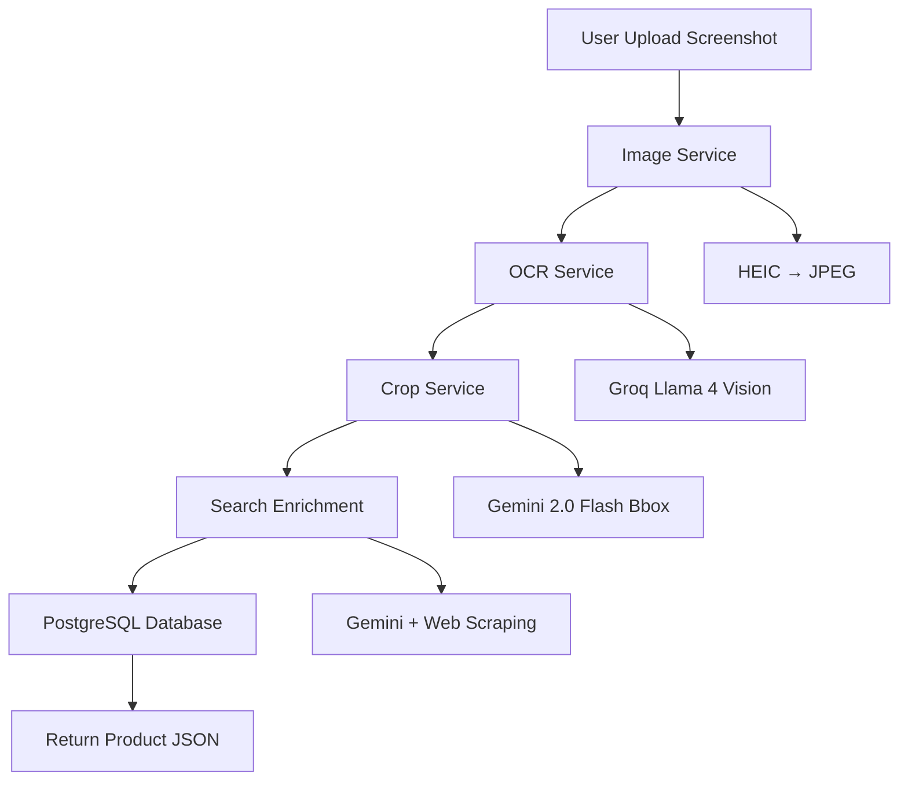

Entropi is a visual bookmarking platform that extracts product information from mobile screenshots. Upload a screenshot of a product from Instagram, TikTok, e-commerce sites, or any other source, and Entropi will extract structured product data.

## Features

<CardGroup cols={2}>
  <Card title="Multi-Format Support" icon="image">
    Supports HEIC (iOS), JPEG, PNG, and WebP formats. Automatically converts and optimizes images for AI processing.
  </Card>
  
  <Card title="AI-Powered OCR" icon="brain">
    Uses Groq's Llama 4 Vision model to extract structured product data from screenshots.
  </Card>
  
  <Card title="Smart Cropping" icon="crop">
    Gemini 2.0 Flash detects and crops the main product from screenshots, removing UI elements.
  </Card>
  
  <Card title="Search Enrichment" icon="magnifying-glass">
    Automatically searches for product URLs and scrapes additional images and metadata using Gemini's function calling.
  </Card>
  
  <Card title="PostgreSQL Storage" icon="database">
    All products are stored in a PostgreSQL database with full relational support for lists and collections.
  </Card>
  
  <Card title="RESTful API" icon="code">
    FastAPI-based REST API with automatic OpenAPI documentation and type validation.
  </Card>
</CardGroup>

## How It Works

## Tech Stack

- **Framework**: FastAPI 0.110+
- **Database**: PostgreSQL 14+ with SQLAlchemy 2.0
- **AI Services**:
  - Groq (Llama 4 Vision) - OCR extraction
  - Gemini 2.0 Flash - Bounding box detection
  - Gemini Pro - Search and function calling
- **Image Processing**: Pillow with HEIC support
- **Authentication**: JWT (python-jose)

## Use Cases

| Use Case | Description |
|----------|-------------|
| E-commerce | Extract product information from shopping screenshots |
| Social Media | Save products discovered on Instagram, TikTok, or Pinterest |
| Wishlists | Build and manage product collections |

## Next Steps

- [Installation Guide](/setup/installation) - Set up your environment
- [API Reference](/api-reference/analyze) - Learn how to use the endpoints
- [Architecture](/architecture) - Understand the system design

<Note>
  This is the V1 (MVP) version of Entropi API. Some features may be experimental or subject to change.
</Note>
