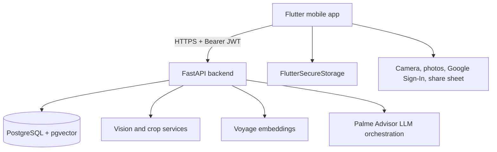

# Palme

Palme is a mobile product memory app. Users capture or import products, organize them into boards called universes, search their saved items, collaborate with friends, track budget impact, and ask an AI assistant questions about their saved products.

The platform is split into two codebases:

- `mobile-palme`: Flutter mobile client.
- `core-palme`: FastAPI backend with PostgreSQL, pgvector, JWT auth, Google OAuth, product ingestion, semantic search, and AI advisor services.

## System diagram



## Product capabilities

- Email/password signup and login.
- Native Google Sign-In on mobile.
- Secure token persistence and expired-session routing.
- Product capture from camera, gallery, screenshots, and URLs.
- Hybrid lexical and semantic product search.
- Universes/boards with ownership, visibility, permissions, and public sharing.
- Friends, friend requests, and public board discovery.
- Budget limits, purchases, and monthly/weekly summaries.
- AI Ask assistant with Markdown responses and product `(ID 18)` references rendered as preview cards.
- French and English localization with persisted language selection.

## Production URL

The production backend domain referenced by the project is:

```text
https://core-palme-production.up.railway.app
```

Some Railway/runtime setups expose the container on port `8080`; when a direct port URL is required, use:

```text
https://core-palme-production.up.railway.app:8080
```

The mobile app currently defaults to the no-port HTTPS URL in release builds unless `API_BASE_URL` is supplied with `--dart-define`.
