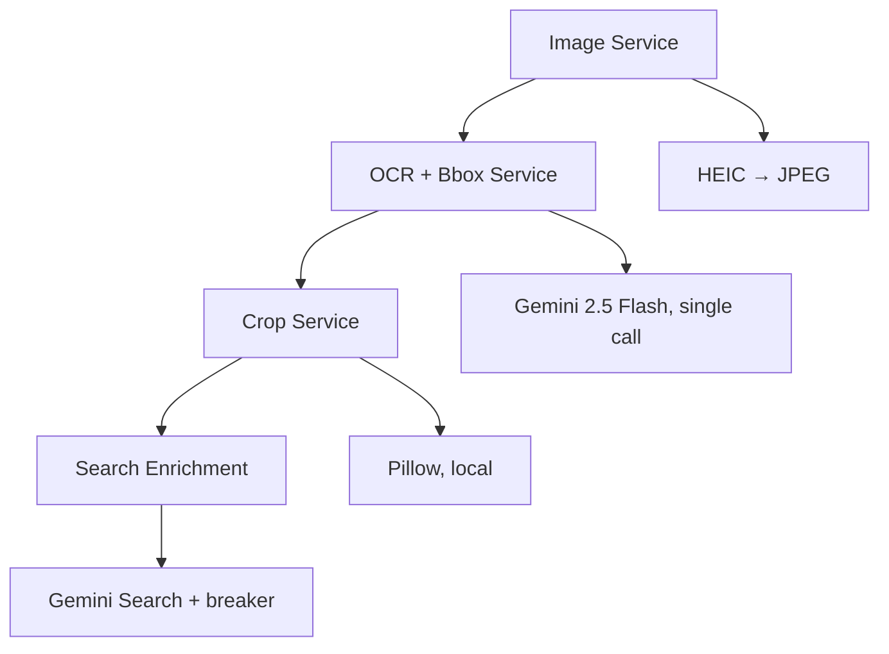

## Services Architecture

Entropi's pipeline consists of **4 core services** that work together to transform a screenshot into a structured product record.

<CardGroup cols={2}>
  <Card
    title="Image Service"
    icon="image"
    href="/services/image-service"
  >
    Converts and optimizes images for AI processing
  </Card>
  <Card
    title="OCR + Bbox Service"
    icon="eye"
    href="/services/ocr-service"
  >
    Extracts product fields and locates the product (single Gemini call)
  </Card>
  <Card
    title="Crop Service"
    icon="crop"
    href="/services/crop-service"
  >
    Crops the image to the bbox using local Pillow (no AI call)
  </Card>
  <Card
    title="Search Enrichment"
    icon="magnifying-glass"
    href="/services/search-enrichment"
  >
    Enriches data with web search and scraping
  </Card>
</CardGroup>

## Service Flow


```mermaid
graph TD
    A[Image Service] --> B[OCR + Bbox Service]
    B --> C[Crop Service]
    C --> D[Search Enrichment]

    A --> A1[HEIC → JPEG]
    B --> B1[Gemini 2.5 Flash, single call]
    C --> C1[Pillow, local]
    D --> D1[Gemini Search + breaker]
```

## Service Dependencies

<AccordionGroup>
  <Accordion title="Image Service">
    **Dependencies**: None (standalone)  
    **Input**: Raw image bytes + MIME type  
    **Output**: Base64-encoded JPEG  
    **Library**: Pillow, pillow-heif
  </Accordion>

  <Accordion title="OCR + Bbox Service">
    **Dependencies**: Image Service output  
    **Input**: Base64 image  
    **Output**: Structured product JSON + normalized bbox  
    **API**: Gemini 2.5 Flash (single call via `extract_and_locate_product`)
  </Accordion>

  <Accordion title="Crop Service">
    **Dependencies**: Image Service + bbox from OCR step  
    **Input**: Base64 image + bbox  
    **Output**: Cropped base64 image  
    **Library**: Pillow (local — no AI call)
  </Accordion>

  <Accordion title="Search Enrichment">
    **Dependencies**: OCR Service + Crop Service  
    **Input**: OCR data + cropped image  
    **Output**: Enriched product data  
    **API**: Gemini grounded search + Web Scraping  
    **Resilience**: 15&nbsp;s `asyncio.wait_for` timeout + circuit breaker (3 failures → 60&nbsp;s skip)
  </Accordion>
</AccordionGroup>

## Service Characteristics

All services are:

<CardGroup cols={3}>
  <Card title="Stateless" icon="server">
    No internal state between calls
  </Card>
  <Card title="Async" icon="bolt">
    Fully async/await compatible
  </Card>
  <Card title="Error-Resilient" icon="shield">
    Graceful degradation on failures
  </Card>
</CardGroup>

## Service Files

<CodeGroup>
```python app/services/image_service.py
async def prepare_image_for_ocr(file_bytes: bytes, mime_type: str) -> str
```

```python app/services/vision/ocr_service.py
async def extract_and_locate_product(base64_image: str) -> Optional[dict]
# Returns product fields + "bbox": [ymin, xmin, ymax, xmax] (0-1000, nullable)
```

```python app/services/vision/image_crop_service.py
async def crop_with_bbox(
    base64_image: str,
    bbox_normalized: list[int],
    padding_percent: float = 0.20,
) -> str
```

```python app/services/search/orchestrator.py
async def enrich_product(ocr_data: dict, cropped_image_base64: Optional[str]) -> Optional[dict]
```
</CodeGroup>

## Integration Example

Here's how services are used together in the pipeline:

```python
# Step 1: Image Service
base64_image = await prepare_image_for_ocr(image_bytes, mime_type)

# Step 2: OCR + bbox (single Gemini call)
ocr_data = await extract_and_locate_product(base64_image)

# Step 3: Local crop (Pillow, no AI call)
cropped_image = await crop_with_bbox(base64_image, ocr_data["bbox"])

# Step 4: Search Enrichment (15s timeout + circuit breaker upstream)
enrichment_data = await enrich_product(ocr_data, cropped_image)
```

## Performance Metrics

<CardGroup cols={2}>
  <Card title="Image Service" icon="gauge">
    **Average**: ~200ms  
    **Success Rate**: 100%
  </Card>
  <Card title="OCR + Bbox Service" icon="gauge">
    **Average**: ~3–4s (single Gemini call)  
    **Success Rate**: 95%+
  </Card>
  <Card title="Crop Service" icon="gauge">
    **Average**: &lt;100ms (local Pillow)  
    **Success Rate**: 99%+ (graceful fallback to original)
  </Card>
  <Card title="Search Enrichment" icon="gauge">
    **Average**: ~3–10s (15&nbsp;s hard cap)  
    **Success Rate**: 70%+ (OCR-only fallback otherwise)
  </Card>
</CardGroup>

## Next Steps

Explore each service in detail:

- [Image Service](/services/image-service) - Image conversion and optimization
- [OCR Service](/services/ocr-service) - Product data extraction
- [Crop Service](/services/crop-service) - Smart image cropping
- [Search Enrichment](/services/search-enrichment) - Data enrichment

