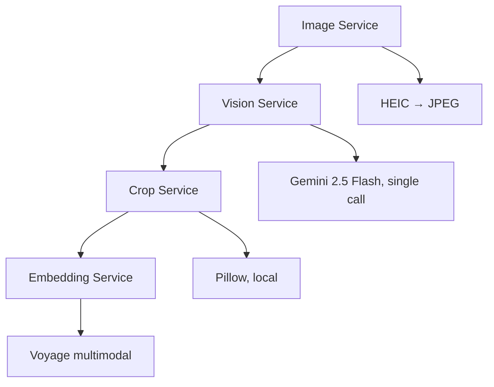

## Services Architecture

Entropi's pipeline consists of **4 core services** that transform a capture into a structured, search-indexed product record.

<CardGroup cols={2}>
  <Card
    title="Image Service"
    icon="image"
    href="/services/image-service"
  >
    Converts and optimizes images for AI processing
  </Card>
  <Card
    title="Vision Service"
    icon="eye"
    href="/services/vision-service"
  >
    Understands the image in one Gemini call (record + bbox)
  </Card>
  <Card
    title="Crop Service"
    icon="crop"
    href="/services/crop-service"
  >
    Crops to the bbox using local Pillow (no AI call)
  </Card>
  <Card
    title="Embedding Service"
    icon="vector-square"
    href="/services/embedding-service"
  >
    Indexes the product into a multimodal vector for search
  </Card>
</CardGroup>

## Service Flow


```mermaid
graph TD
    A[Image Service] --> B[Vision Service]
    B --> C[Crop Service]
    C --> D[Embedding Service]

    A --> A1[HEIC → JPEG]
    B --> B1[Gemini 2.5 Flash, single call]
    C --> C1[Pillow, local]
    D --> D1[Voyage multimodal]
```

## Service Dependencies

<AccordionGroup>
  <Accordion title="Image Service">
    **Dependencies**: None (standalone)
    **Input**: Raw image bytes + MIME type
    **Output**: Base64-encoded JPEG
    **Library**: Pillow, pillow-heif
  </Accordion>

  <Accordion title="Vision Service">
    **Dependencies**: Image Service output
    **Input**: Base64 image
    **Output**: Structured lifestyle record + normalized bbox
    **API**: Gemini 2.5 Flash (single call via `analyze_capture`)
  </Accordion>

  <Accordion title="Crop Service">
    **Dependencies**: Image Service + bbox from the Vision Service
    **Input**: Base64 image + bbox
    **Output**: Cropped base64 image
    **Library**: Pillow (local — no AI call)
  </Accordion>

  <Accordion title="Embedding Service">
    **Dependencies**: The built record + cropped image
    **Input**: Composed text + image
    **Output**: 1024-dim multimodal vector
    **API**: Voyage AI (`voyage-multimodal-3`)
    **Note**: Best-effort — a failure leaves the product `ready` and unindexed
  </Accordion>
</AccordionGroup>

## Service Characteristics

All services are:

<CardGroup cols={3}>
  <Card title="Stateless" icon="server">
    No internal state between calls
  </Card>
  <Card title="Async" icon="bolt">
    Fully async/await compatible
  </Card>
  <Card title="Error-Resilient" icon="shield">
    Graceful degradation on failures
  </Card>
</CardGroup>

## Service Files

<CodeGroup>
```python app/services/vision/image_service.py
async def prepare_image_for_ocr(file_bytes: bytes, mime_type: str) -> str
```

```python app/services/vision/vision_service.py
async def analyze_capture(base64_image: str) -> Optional[dict]
# Returns the lifestyle record + "bbox": [ymin, xmin, ymax, xmax] (0-1000, nullable)
```

```python app/services/vision/image_crop_service.py
async def crop_with_bbox(
    base64_image: str,
    bbox_normalized: list[int],
    padding_percent: float = 0.20,
) -> str
```

```python app/services/embedding/indexing.py
async def compute_product_embedding(text: str | None, image_base64: str | None) -> list[float]
```
</CodeGroup>

## Integration Example

Here is how the services are used together in the capture pipeline:

```python
# Step 1: Image Service
base64_image = await prepare_image_for_ocr(image_bytes, mime_type)

# Step 2: Vision understanding (single Gemini call)
record = await analyze_capture(base64_image)
bbox = record.pop("bbox", None)

# Step 3: Local crop (Pillow, no AI call)
cropped_image = await crop_with_bbox(base64_image, bbox)

# Step 4: Embedding (best-effort, for semantic search)
text = build_product_text(record)
embedding = await compute_product_embedding(text, cropped_image)
```

## Performance Metrics

<CardGroup cols={2}>
  <Card title="Image Service" icon="gauge">
    **Average**: ~200ms
    **Success Rate**: 100%
  </Card>
  <Card title="Vision Service" icon="gauge">
    **Average**: ~3–5s (single Gemini call)
    **Success Rate**: 95%+
  </Card>
  <Card title="Crop Service" icon="gauge">
    **Average**: &lt;100ms (local Pillow)
    **Success Rate**: 99%+ (graceful fallback to original)
  </Card>
  <Card title="Embedding Service" icon="gauge">
    **Average**: ~1–2s (best-effort)
    **Success Rate**: leaves product `ready` even on failure
  </Card>
</CardGroup>

## Next Steps

Explore each service in detail:

- [Image Service](/services/image-service) — image conversion and optimization
- [Vision Service](/services/vision-service) — single-call visual understanding
- [Crop Service](/services/crop-service) — local bbox crop
- [Embedding Service](/services/embedding-service) — semantic-search indexing
