## Services Architecture

Entropi's pipeline consists of **4 core services** that work together to transform a screenshot into a structured product record.

<CardGroup cols={2}>
  <Card
    title="Image Service"
    icon="image"
    href="/services/image-service"
  >
    Converts and optimizes images for AI processing
  </Card>
  <Card
    title="OCR Service"
    icon="eye"
    href="/services/ocr-service"
  >
    Extracts product information using Vision AI
  </Card>
  <Card
    title="Crop Service"
    icon="crop"
    href="/services/crop-service"
  >
    Intelligently crops product images
  </Card>
  <Card
    title="Search Enrichment"
    icon="magnifying-glass"
    href="/services/search-enrichment"
  >
    Enriches data with web search and scraping
  </Card>
</CardGroup>

## Service Flow

```mermaid
graph TD
    A[Image Service] --> B[OCR Service]
    B --> C[Crop Service]
    C --> D[Search Enrichment]
    
    A --> A1[HEIC → JPEG]
    B --> B1[Groq Vision]
    C --> C1[Gemini Bbox]
    D --> D1[Gemini Search]
```



## Service Dependencies

<AccordionGroup>
  <Accordion title="Image Service">
    **Dependencies**: None (standalone)  
    **Input**: Raw image bytes + MIME type  
    **Output**: Base64-encoded JPEG  
    **Library**: Pillow, pillow-heif
  </Accordion>

  <Accordion title="OCR Service">
    **Dependencies**: Image Service output  
    **Input**: Base64 image  
    **Output**: Structured product JSON  
    **API**: Groq (Llama 4 Vision)
  </Accordion>

  <Accordion title="Crop Service">
    **Dependencies**: Image Service + OCR Service  
    **Input**: Base64 image + OCR context  
    **Output**: Cropped base64 image  
    **API**: Gemini 2.0 Flash
  </Accordion>

  <Accordion title="Search Enrichment">
    **Dependencies**: OCR Service + Crop Service  
    **Input**: OCR data + cropped image  
    **Output**: Enriched product data  
    **API**: Gemini Pro + Web Scraping
  </Accordion>
</AccordionGroup>

## Service Characteristics

All services are:

<CardGroup cols={3}>
  <Card title="Stateless" icon="server">
    No internal state between calls
  </Card>
  <Card title="Async" icon="bolt">
    Fully async/await compatible
  </Card>
  <Card title="Error-Resilient" icon="shield">
    Graceful degradation on failures
  </Card>
</CardGroup>

## Service Files

<CodeGroup>
```python app/services/image_service.py
async def prepare_image_for_ocr(file_bytes: bytes, mime_type: str) -> str
```

```python app/services/ocr_service.py
async def analyze_product_screenshot(base64_image: str) -> Optional[dict]
```

```python app/services/image_crop_service.py
async def crop_product_image(base64_image: str, ocr_context: Optional[dict]) -> str
```

```python app/services/search_enrichement/orchestrator.py
async def enrich_product(ocr_data: dict, cropped_image_base64: Optional[str]) -> Optional[dict]
```
</CodeGroup>

## Integration Example

Here's how services are used together in the pipeline:

```python
# Step 1: Image Service
base64_image = await prepare_image_for_ocr(image_bytes, mime_type)

# Step 2: OCR Service
ocr_data = await analyze_product_screenshot(base64_image)

# Step 3: Crop Service
cropped_image = await crop_product_image(base64_image, ocr_context=ocr_data)

# Step 4: Search Enrichment
enrichment_data = await enrich_product(ocr_data, cropped_image)
```

## Performance Metrics

<CardGroup cols={2}>
  <Card title="Image Service" icon="gauge">
    **Average**: ~200ms  
    **Success Rate**: 100%
  </Card>
  <Card title="OCR Service" icon="gauge">
    **Average**: ~3-5s  
    **Success Rate**: 95%+
  </Card>
  <Card title="Crop Service" icon="gauge">
    **Average**: ~2-3s  
    **Success Rate**: 90%+
  </Card>
  <Card title="Search Enrichment" icon="gauge">
    **Average**: ~5-10s  
    **Success Rate**: 70%+ (depends on product)
  </Card>
</CardGroup>

## Next Steps

Explore each service in detail:

- [Image Service](/services/image-service) - Image conversion and optimization
- [OCR Service](/services/ocr-service) - Product data extraction
- [Crop Service](/services/crop-service) - Smart image cropping
- [Search Enrichment](/services/search-enrichment) - Data enrichment

