Entropi's pipeline consists of 4 core services that work together to transform a screenshot into a structured product record.

## Service Flow

```mermaid
graph TD
    A[Image Service] --> B[OCR Service]
    B --> C[Crop Service]
    C --> D[Search Enrichment]
    
    A --> A1[HEIC → JPEG]
    B --> B1[Groq Vision]
    C --> C1[Gemini Bbox]
    D --> D1[Gemini Search]
```



## Services

| Service | Description | Link |
|---------|-------------|------|
| Image Service | Converts and optimizes images for AI processing | [Image Service](/services/image-service) |
| OCR Service | Extracts product information using Vision AI | [OCR Service](/services/ocr-service) |
| Crop Service | Intelligently crops product images | [Crop Service](/services/crop-service) |
| Search Enrichment | Enriches data with web search and scraping | [Search Enrichment](/services/search-enrichment) |

## Service Dependencies

| Service | Dependencies | Input | Output | API/Library |
|---------|--------------|-------|--------|--------------|
| Image Service | None (standalone) | Raw image bytes + MIME type | Base64-encoded JPEG | Pillow, pillow-heif |
| OCR Service | Image Service output | Base64 image | Structured product JSON | Groq (Llama 4 Vision) |
| Crop Service | Image Service + OCR Service | Base64 image + OCR context | Cropped base64 image | Gemini 2.0 Flash |
| Search Enrichment | OCR Service + Crop Service | OCR data + cropped image | Enriched product data | Gemini Pro + Web Scraping |

## Service Characteristics

All services are:

- **Stateless**: No internal state between calls
- **Async**: Fully async/await compatible
- **Error-Resilient**: Graceful degradation on failures

## Service Files

```python title="app/services/image_service.py"
async def prepare_image_for_ocr(file_bytes: bytes, mime_type: str) -> str
```

```python title="app/services/ocr_service.py"
async def analyze_product_screenshot(base64_image: str) -> Optional[dict]
```

```python title="app/services/image_crop_service.py"
async def crop_product_image(base64_image: str, ocr_context: Optional[dict]) -> str
```

```python title="app/services/search_enrichement/orchestrator.py"
async def enrich_product(ocr_data: dict, cropped_image_base64: Optional[str]) -> Optional[dict]
```

## Integration Example

Here's how services are used together in the pipeline:

```python title="pipeline_integration.py"
# Step 1: Image Service
base64_image = await prepare_image_for_ocr(image_bytes, mime_type)

# Step 2: OCR Service
ocr_data = await analyze_product_screenshot(base64_image)

# Step 3: Crop Service
cropped_image = await crop_product_image(base64_image, ocr_context=ocr_data)

# Step 4: Search Enrichment
enrichment_data = await enrich_product(ocr_data, cropped_image)
```

## Performance Metrics

| Service | Average Time | Success Rate |
|---------|--------------|--------------|
| Image Service | ~200ms | 100% |
| OCR Service | ~3-5s | 95%+ |
| Crop Service | ~2-3s | 90%+ |
| Search Enrichment | ~5-10s | 70%+ (depends on product) |

## Related Resources

- [Image Service](/services/image-service) - Image conversion and optimization
- [OCR Service](/services/ocr-service) - Product data extraction
- [Crop Service](/services/crop-service) - Smart image cropping
- [Search Enrichment](/services/search-enrichment) - Data enrichment
