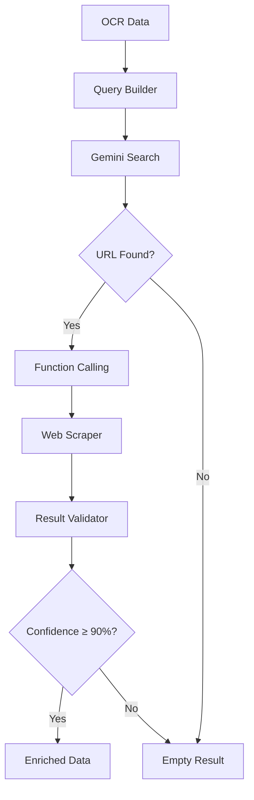

The Search Enrichment service finds merchant product URLs and scrapes additional product information using Gemini's search grounding and function calling features.

**File**: `app/services/search_enrichement/orchestrator.py`

## Function

<ParamField body="enrich_product" type="async function">
  Searches for product URL and enriches data with scraped information.
</ParamField>

```python title="function_signature.py"
async def enrich_product(
    ocr_data: Dict[str, Any],
    cropped_image_base64: Optional[str] = None
) -> Optional[Dict[str, Any]]
```

<ParamField body="ocr_data" type="dict" required>
  Product data from OCR service
</ParamField>
<ParamField body="cropped_image_base64" type="string" optional>
  Cropped product image for visual search
</ParamField>

**Returns**: Enriched product data with confidence score, or `None` if enrichment fails

## How It Works

1. **Query Building**: Builds a search query from product name, merchant, and object type.

2. **Gemini Search**: Uses Gemini Pro with search grounding to find merchant product URLs.

3. **Function Calling**: If URL found, Gemini calls `scrape_product_images()` function to scrape product images.

4. **Validation**: Validates results and calculates confidence score (0-100%).

5. **Return**: Returns enriched data only if confidence ≥ 90%.

## Architecture



## Service Components

| Component | File | Description |
|-----------|------|-------------|
| Orchestrator | `orchestrator.py` | Main entry point |
| Query Builder | `query_builder.py` | Builds search queries |
| Search Handler | `search_handler.py` | Gemini search + function calling |
| Result Validator | `result_validator.py` | Validates and scores results |

## Enriched Data Structure

```json title="enriched_data.json"
{
  "merchant_url": "https://example.com/product/123",
  "product_images": [
    "https://example.com/img1.jpg",
    "https://example.com/img2.jpg"
  ],
  "search_confidence": 95,
  "search_query": "leather jacket brand name"
}
```

<ParamField body="merchant_url" type="string">
  Found product URL on merchant website
</ParamField>
<ParamField body="product_images" type="array">
  Array of product image URLs from scraping
</ParamField>
<ParamField body="search_confidence" type="integer">
  Confidence score (0-100%)
</ParamField>
<ParamField body="search_query" type="string">
  Query used for search
</ParamField>

## Query Building

The query builder creates optimized search queries:

```python title="query_builder.py"
def build_search_query(product_name: str, merchant: str, object_type: str) -> str:
    # Example: "leather jacket brand name"
    # Prioritizes: product name + merchant + object type
    query_parts = []
    
    if product_name:
        query_parts.append(product_name)
    if merchant and merchant != "Not specified":
        query_parts.append(merchant)
    if object_type:
        query_parts.append(object_type)
    
    return " ".join(query_parts)
```

## Gemini Function Calling

Gemini uses function calling to trigger web scraping:

```python title="function_calling.py"
functions = [
    {
        "name": "scrape_product_images",
        "description": "Scrape product images from a merchant URL",
        "parameters": {
            "type": "object",
            "properties": {
                "url": {
                    "type": "string",
                    "description": "Product URL to scrape"
                }
            },
            "required": ["url"]
        }
    }
]
```

When Gemini finds a product URL, it automatically calls this function to scrape images.

## Confidence Scoring

| Confidence Level | Criteria |
|------------------|----------|
| High (≥90%) | URL found and validated, images scraped successfully, data merged with OCR |
| Low (<90%) | URL not found, scraping failed, falls back to OCR only |

## Usage Example

```python title="usage_example.py"
from app.services.search_enrichement import enrich_product

# Enrich with OCR data and cropped image
enrichment_data = await enrich_product(
    ocr_data={
        "name": "Leather Jacket",
        "merchant": "Brand Name",
        "object_type": "jacket"
    },
    cropped_image_base64=cropped_image
)

if enrichment_data and enrichment_data.get("search_confidence", 0) >= 90:
    print(f"Found URL: {enrichment_data['merchant_url']}")
    print(f"Confidence: {enrichment_data['search_confidence']}%")
else:
    print("Enrichment failed or low confidence")
```

## Performance

| Metric | Value |
|--------|-------|
| Average Time | 5-10 seconds per product |
| Success Rate | 70%+ (depends on product availability) |
| Confidence Threshold | 90% minimum |
| Model | Gemini Pro |

## Configuration

Add to your `.env` file:

```bash title=".env"
GEMINI_API_KEY=your_gemini_api_key_here
```

The service uses the same Gemini API key as the Crop Service.

## Dependencies

```txt title="requirements.txt"
google-generativeai>=0.3.0
beautifulsoup4>=4.12.0
requests>=2.31.0
```

## Error Handling

The service implements graceful degradation:

- If search fails → returns `None`, pipeline continues with OCR only
- If scraping fails → returns low confidence, pipeline continues
- If confidence < 90% → returns empty result, pipeline continues

The pipeline never fails due to enrichment errors.

## Web Scraping

The scraper (`image_scrapper_service.py`) extracts:

| Type | Methods |
|------|---------|
| Product Images | JSON-LD structured data, Open Graph meta tags, HTML img tags with product-related classes |
| Product Metadata | Product description, price information, availability status (when available) |

## Limitations

| Limitation | Description |
|------------|-------------|
| Product Availability | Only works if product is available online and searchable |
| Merchant Websites | Some websites may block scraping or require authentication |
| Search Accuracy | Depends on product name uniqueness and merchant information quality |

## Related Resources

- [API Reference](/api-reference/analyze) - See how enrichment is used
- [Architecture](/architecture) - Learn about the pipeline
