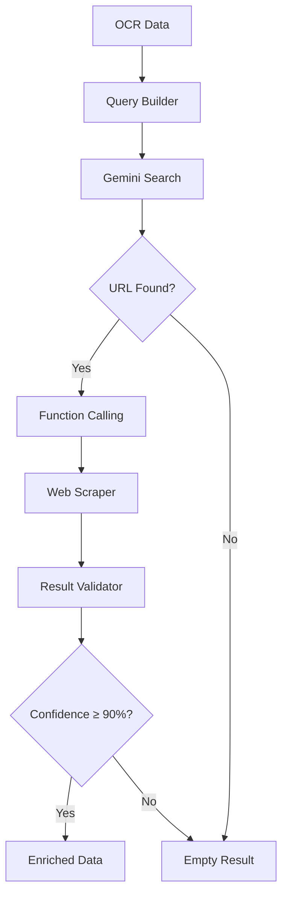

## Overview

The **Search Enrichment** service finds merchant product URLs and scrapes additional product information using Gemini's search grounding and function calling features.

**File**: `app/services/search/orchestrator.py`

## Function

<ParamField body="enrich_product" type="async function">
  Searches for product URL and enriches data with scraped information.
</ParamField>

```python
async def enrich_product(
    ocr_data: Dict[str, Any],
    cropped_image_base64: Optional[str] = None
) -> Optional[Dict[str, Any]]
```

<ParamField body="ocr_data" type="dict" required>
  Product data from OCR service
</ParamField>
<ParamField body="cropped_image_base64" type="string" optional>
  Cropped product image for visual search
</ParamField>

**Returns**: Enriched product data with confidence score, or `None` if enrichment fails

## How It Works

<Steps>
  <Step title="1. Query Building">
    Builds a search query from product name, merchant, and object type.
  </Step>

  <Step title="2. Gemini Search">
    Uses Gemini Pro with search grounding to find merchant product URLs.
  </Step>

  <Step title="3. Function Calling">
    If URL found, Gemini calls `scrape_product_images()` function to scrape product images.
  </Step>

  <Step title="4. Validation">
    Validates results and calculates confidence score (0-100%).
  </Step>

  <Step title="5. Return">
    Returns enriched data only if confidence ≥ 90%.
  </Step>
</Steps>

## Architecture


```mermaid
graph TD
    A[OCR Data] --> B[Query Builder]
    B --> C[Gemini Search]
    C --> D{URL Found?}
    D -->|Yes| E[Function Calling]
    E --> F[Web Scraper]
    F --> G[Result Validator]
    D -->|No| H[Empty Result]
    G --> I{Confidence ≥ 90%?}
    I -->|Yes| J[Enriched Data]
    I -->|No| H
```

## Service Components

<CardGroup cols={2}>
  <Card title="Orchestrator" icon="diagram-project">
    `orchestrator.py` - Main entry point
  </Card>
  <Card title="Query Builder" icon="magnifying-glass">
    `query_builder.py` - Builds search queries
  </Card>
  <Card title="Search Handler" icon="brain">
    `search_handler.py` - Gemini search + function calling
  </Card>
  <Card title="Result Validator" icon="check-circle">
    `result_validator.py` - Validates and scores results
  </Card>
</CardGroup>

## Enriched Data Structure

```json
{
  "merchant_url": "https://example.com/product/123",
  "product_images": [
    "https://example.com/img1.jpg",
    "https://example.com/img2.jpg"
  ],
  "search_confidence": 95,
  "search_query": "leather jacket brand name"
}
```

<ParamField body="merchant_url" type="string">
  Found product URL on merchant website
</ParamField>
<ParamField body="product_images" type="array">
  Array of product image URLs from scraping
</ParamField>
<ParamField body="search_confidence" type="integer">
  Confidence score (0-100%)
</ParamField>
<ParamField body="search_query" type="string">
  Query used for search
</ParamField>

## Query Building

The query builder creates optimized search queries:

```python
def build_search_query(product_name: str, merchant: str, object_type: str) -> str:
    # Example: "leather jacket brand name"
    # Prioritizes: product name + merchant + object type
    query_parts = []
    
    if product_name:
        query_parts.append(product_name)
    if merchant and merchant != "Not specified":
        query_parts.append(merchant)
    if object_type:
        query_parts.append(object_type)
    
    return " ".join(query_parts)
```

## Gemini Function Calling

Gemini uses function calling to trigger web scraping:

```python
functions = [
    {
        "name": "scrape_product_images",
        "description": "Scrape product images from a merchant URL",
        "parameters": {
            "type": "object",
            "properties": {
                "url": {
                    "type": "string",
                    "description": "Product URL to scrape"
                }
            },
            "required": ["url"]
        }
    }
]
```

When Gemini finds a product URL, it automatically calls this function to scrape images.

## Confidence Scoring

Results are validated and scored:

<CardGroup cols={2}>
  <Card title="High Confidence (≥90%)" icon="check-circle">
    URL found and validated  
    Images scraped successfully  
    Data merged with OCR
  </Card>
  <Card title="Low Confidence (<90%)" icon="x-circle">
    URL not found  
    Scraping failed  
    Falls back to OCR only
  </Card>
</CardGroup>

## Resilience

Enrichment is the slowest and least predictable pipeline step (Gemini
grounded search + scraping). Two mechanisms keep `/pipeline/analyze`
responsive even when the search backend is degraded:

### Adaptive timeout

The pipeline router wraps `enrich_product` in
`asyncio.wait_for(..., timeout=SEARCH_TIMEOUT)`, currently
**15&nbsp;seconds**. On timeout the product still reaches `ready` —
just with OCR-only data (no `merchant_url`, no scraped images, no
`search_confidence`).

### Circuit breaker (process-local)

When enrichment fails repeatedly, the orchestrator stops calling the
search backend for a cooldown window:

| Setting | Value | Source |
| --- | --- | --- |
| Failure threshold | **3 consecutive failures** | `CIRCUIT_BREAKER_THRESHOLD` |
| Cooldown after open | **60 seconds** | `CIRCUIT_BREAKER_COOLDOWN_SECONDS` |
| Timeout | **15 seconds** | `SEARCH_TIMEOUT` |

Defined in `app/services/search/config.py`.

What counts as a failure: an `asyncio.wait_for` timeout, a raised
exception, or an empty result from Gemini.

What does **not** count as a failure: a low-confidence result
(`<90%`). The breaker only opens on actual service failure — a
confident "we couldn't find this product online" result is normal
behavior and resets the failure counter.

While the breaker is open, `enrich_product` short-circuits immediately
to OCR-only without contacting Gemini. The breaker is process-local
state (not shared across workers), so under multi-worker deployments
each worker has an independent counter.

### Combined effect

In practice, products always reach `ready`. The `tags` field omits
`search_confidence:<n>` when enrichment was skipped, so clients can
distinguish enriched from OCR-only products without a separate flag.

## Concurrency

The Gemini grounded-search SDK call is synchronous; the scraper does
blocking HTTP and Pillow work. Both are wrapped in `asyncio.to_thread`,
so concurrent pipeline runs do not serialize on the event loop.

## Usage Example

```python
from app.services.search import enrich_product

# Enrich with OCR data and cropped image
enrichment_data = await enrich_product(
    ocr_data={
        "name": "Leather Jacket",
        "merchant": "Brand Name",
        "object_type": "jacket"
    },
    cropped_image_base64=cropped_image
)

if enrichment_data and enrichment_data.get("search_confidence", 0) >= 90:
    print(f"Found URL: {enrichment_data['merchant_url']}")
    print(f"Confidence: {enrichment_data['search_confidence']}%")
else:
    print("Enrichment failed or low confidence")
```

## Performance

<CardGroup cols={2}>
  <Card title="Average Time" icon="clock">
    ~3–10 seconds (15&nbsp;s hard cap)
  </Card>
  <Card title="Success Rate" icon="check-circle">
    70%+ (OCR-only fallback otherwise)
  </Card>
  <Card title="Confidence Threshold" icon="target">
    90% minimum
  </Card>
  <Card title="Resilience" icon="shield">
    15&nbsp;s timeout + 3-failure circuit breaker (60&nbsp;s skip)
  </Card>
</CardGroup>

## Configuration

Add to your `.env` file:

```bash
GEMINI_API_KEY=your_gemini_api_key_here
```

The service uses the same Gemini API key as the Crop Service.

## Dependencies

```txt
google-generativeai>=0.3.0
beautifulsoup4>=4.12.0
requests>=2.31.0
```

## Error Handling

<Warning>
  The service implements **graceful degradation** at every layer:
  - Timeout (>15&nbsp;s) → OCR-only fallback; the breaker's failure counter is incremented
  - Exception → OCR-only fallback; counter incremented
  - Empty result → OCR-only fallback; counter incremented
  - Low confidence (&lt;90%) → OCR-only fallback; counter is **reset** (not a service failure)
  - Open breaker → enrichment skipped immediately for 60&nbsp;s

  The pipeline never fails due to enrichment errors.
</Warning>

## Web Scraping

The scraper (`image_scrapper_service.py`) extracts:

<AccordionGroup>
  <Accordion title="Product Images">
    Finds all product images from the merchant page using:
    - JSON-LD structured data
    - Open Graph meta tags
    - HTML img tags with product-related classes
  </Accordion>

  <Accordion title="Product Metadata">
    Extracts additional metadata when available:
    - Product description
    - Price information
    - Availability status
  </Accordion>
</AccordionGroup>

## Limitations

<AccordionGroup>
  <Accordion title="Product Availability">
    Only works if product is available online and searchable.
  </Accordion>

  <Accordion title="Merchant Websites">
    Some websites may block scraping or require authentication.
  </Accordion>

  <Accordion title="Search Accuracy">
    Depends on product name uniqueness and merchant information quality.
  </Accordion>
</AccordionGroup>

## Next Steps

- Check the [API Reference](/api-reference/analyze) to see how enrichment is used
- Learn about the [Architecture](/architecture) pipeline

